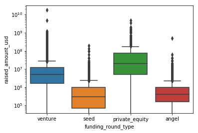
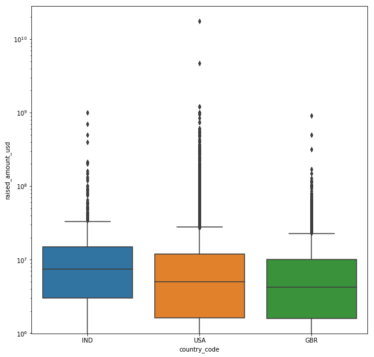
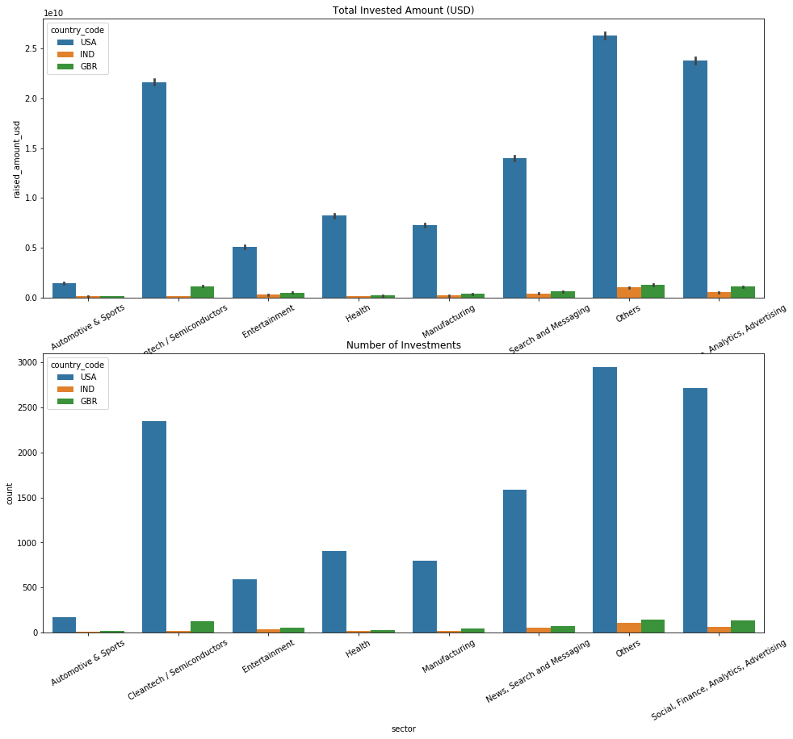

# Data Cleaning and EDA with pandas

## Sortig out the correct encoding


```python
import numpy as np
import pandas as pd
import matplotlib.pyplot as plt
import seaborn as sns

# using encoding = "ISO-8859-1" to avoid pandas encoding error
rounds = pd.read_csv("rounds2.csv", encoding = 'ISO-8859-1')
companies = pd.read_csv("companies.txt", sep = "\t", encoding = 'ISO-8859-1')
```


```python
rounds.head()
```


<div>
<style scoped>
    .dataframe tbody tr th:only-of-type {
        vertical-align: middle;
    }

    .dataframe tbody tr th {
        vertical-align: top;
    }

    .dataframe thead th {
        text-align: right;
    }
</style>
<table border="1" class="dataframe">
  <thead>
    <tr style="text-align: right;">
      <th></th>
      <th>company_permalink</th>
      <th>funding_round_permalink</th>
      <th>funding_round_type</th>
      <th>funding_round_code</th>
      <th>funded_at</th>
      <th>raised_amount_usd</th>
    </tr>
  </thead>
  <tbody>
    <tr>
      <th>0</th>
      <td>/organization/-fame</td>
      <td>/funding-round/9a01d05418af9f794eebff7ace91f638</td>
      <td>venture</td>
      <td>B</td>
      <td>05-01-2015</td>
      <td>10000000.0</td>
    </tr>
    <tr>
      <th>1</th>
      <td>/ORGANIZATION/-QOUNTER</td>
      <td>/funding-round/22dacff496eb7acb2b901dec1dfe5633</td>
      <td>venture</td>
      <td>A</td>
      <td>14-10-2014</td>
      <td>NaN</td>
    </tr>
    <tr>
      <th>2</th>
      <td>/organization/-qounter</td>
      <td>/funding-round/b44fbb94153f6cdef13083530bb48030</td>
      <td>seed</td>
      <td>NaN</td>
      <td>01-03-2014</td>
      <td>700000.0</td>
    </tr>
    <tr>
      <th>3</th>
      <td>/ORGANIZATION/-THE-ONE-OF-THEM-INC-</td>
      <td>/funding-round/650b8f704416801069bb178a1418776b</td>
      <td>venture</td>
      <td>B</td>
      <td>30-01-2014</td>
      <td>3406878.0</td>
    </tr>
    <tr>
      <th>4</th>
      <td>/organization/0-6-com</td>
      <td>/funding-round/5727accaeaa57461bd22a9bdd945382d</td>
      <td>venture</td>
      <td>A</td>
      <td>19-03-2008</td>
      <td>2000000.0</td>
    </tr>
  </tbody>
</table>
</div>


```python
rounds.info()
```

    <class 'pandas.core.frame.DataFrame'>
    RangeIndex: 114949 entries, 0 to 114948
    Data columns (total 6 columns):
    company_permalink          114949 non-null object
    funding_round_permalink    114949 non-null object
    funding_round_type         114949 non-null object
    funding_round_code         31140 non-null object
    funded_at                  114949 non-null object
    raised_amount_usd          94959 non-null float64
    dtypes: float64(1), object(5)
    memory usage: 5.3+ MB


```python
companies.head()
```


<div>
<style scoped>
    .dataframe tbody tr th:only-of-type {
        vertical-align: middle;
    }

    .dataframe tbody tr th {
        vertical-align: top;
    }

    .dataframe thead th {
        text-align: right;
    }
</style>
<table border="1" class="dataframe">
  <thead>
    <tr style="text-align: right;">
      <th></th>
      <th>permalink</th>
      <th>name</th>
      <th>homepage_url</th>
      <th>category_list</th>
      <th>status</th>
      <th>country_code</th>
      <th>state_code</th>
      <th>region</th>
      <th>city</th>
      <th>founded_at</th>
    </tr>
  </thead>
  <tbody>
    <tr>
      <th>0</th>
      <td>/Organization/-Fame</td>
      <td>#fame</td>
      <td>http://livfame.com</td>
      <td>Media</td>
      <td>operating</td>
      <td>IND</td>
      <td>16</td>
      <td>Mumbai</td>
      <td>Mumbai</td>
      <td>NaN</td>
    </tr>
    <tr>
      <th>1</th>
      <td>/Organization/-Qounter</td>
      <td>:Qounter</td>
      <td>http://www.qounter.com</td>
      <td>Application Platforms|Real Time|Social Network...</td>
      <td>operating</td>
      <td>USA</td>
      <td>DE</td>
      <td>DE - Other</td>
      <td>Delaware City</td>
      <td>04-09-2014</td>
    </tr>
    <tr>
      <th>2</th>
      <td>/Organization/-The-One-Of-Them-Inc-</td>
      <td>(THE) ONE of THEM,Inc.</td>
      <td>http://oneofthem.jp</td>
      <td>Apps|Games|Mobile</td>
      <td>operating</td>
      <td>NaN</td>
      <td>NaN</td>
      <td>NaN</td>
      <td>NaN</td>
      <td>NaN</td>
    </tr>
    <tr>
      <th>3</th>
      <td>/Organization/0-6-Com</td>
      <td>0-6.com</td>
      <td>http://www.0-6.com</td>
      <td>Curated Web</td>
      <td>operating</td>
      <td>CHN</td>
      <td>22</td>
      <td>Beijing</td>
      <td>Beijing</td>
      <td>01-01-2007</td>
    </tr>
    <tr>
      <th>4</th>
      <td>/Organization/004-Technologies</td>
      <td>004 Technologies</td>
      <td>http://004gmbh.de/en/004-interact</td>
      <td>Software</td>
      <td>operating</td>
      <td>USA</td>
      <td>IL</td>
      <td>Springfield, Illinois</td>
      <td>Champaign</td>
      <td>01-01-2010</td>
    </tr>
  </tbody>
</table>
</div>


```python
companies.info()
```

    <class 'pandas.core.frame.DataFrame'>
    RangeIndex: 66368 entries, 0 to 66367
    Data columns (total 10 columns):
    permalink        66368 non-null object
    name             66367 non-null object
    homepage_url     61310 non-null object
    category_list    63220 non-null object
    status           66368 non-null object
    country_code     59410 non-null object
    state_code       57821 non-null object
    region           58338 non-null object
    city             58340 non-null object
    founded_at       51147 non-null object
    dtypes: object(10)
    memory usage: 5.1+ MB


```python
# converting all permalinks to lowercase
rounds['company_permalink'] = rounds['company_permalink'].str.lower()
companies['permalink'] = companies['permalink'].str.lower()
```


```python
len(companies.permalink.unique())
```


    66368


```python
len(rounds.company_permalink.unique())
```


    66370


So we have 2 extra permalink in the rounds. We will find companies present in rounds file but not in the companies file


```python
rounds.loc[~rounds['company_permalink'].isin(companies['permalink'])]
```


<div>
<style scoped>
    .dataframe tbody tr th:only-of-type {
        vertical-align: middle;
    }

    .dataframe tbody tr th {
        vertical-align: top;
    }

    .dataframe thead th {
        text-align: right;
    }
</style>
<table border="1" class="dataframe">
  <thead>
    <tr style="text-align: right;">
      <th></th>
      <th>company_permalink</th>
      <th>funding_round_permalink</th>
      <th>funding_round_type</th>
      <th>funding_round_code</th>
      <th>funded_at</th>
      <th>raised_amount_usd</th>
    </tr>
  </thead>
  <tbody>
    <tr>
      <th>29597</th>
      <td>/organization/e-cãŠbica</td>
      <td>/funding-round/8491f74869e4fe8ba9c378394f8fbdea</td>
      <td>seed</td>
      <td>NaN</td>
      <td>01-02-2015</td>
      <td>NaN</td>
    </tr>
    <tr>
      <th>31863</th>
      <td>/organization/energystone-games-灵石游戏</td>
      <td>/funding-round/b89553f3d2279c5683ae93f45a21cfe0</td>
      <td>seed</td>
      <td>NaN</td>
      <td>09-08-2014</td>
      <td>NaN</td>
    </tr>
    <tr>
      <th>45176</th>
      <td>/organization/huizuche-com-惠ç§ÿ车</td>
      <td>/funding-round/8f8a32dbeeb0f831a78702f83af78a36</td>
      <td>seed</td>
      <td>NaN</td>
      <td>18-09-2014</td>
      <td>NaN</td>
    </tr>
    <tr>
      <th>58473</th>
      <td>/organization/magnet-tech-磁石科技</td>
      <td>/funding-round/8fc91fbb32bc95e97f151dd0cb4166bf</td>
      <td>seed</td>
      <td>NaN</td>
      <td>16-08-2014</td>
      <td>1625585.0</td>
    </tr>
    <tr>
      <th>101036</th>
      <td>/organization/tipcat-interactive-沙èˆÿ信息ç...</td>
      <td>/funding-round/41005928a1439cb2d706a43cb661f60f</td>
      <td>seed</td>
      <td>NaN</td>
      <td>06-09-2010</td>
      <td>NaN</td>
    </tr>
    <tr>
      <th>109969</th>
      <td>/organization/weiche-tech-喂车科技</td>
      <td>/funding-round/f74e457f838b81fa0b29649740f186d8</td>
      <td>venture</td>
      <td>A</td>
      <td>06-09-2015</td>
      <td>NaN</td>
    </tr>
    <tr>
      <th>113839</th>
      <td>/organization/zengame-禅游科技</td>
      <td>/funding-round/6ba28fb4f3eadf5a9c6c81bc5dde6cdf</td>
      <td>seed</td>
      <td>NaN</td>
      <td>17-07-2010</td>
      <td>NaN</td>
    </tr>
  </tbody>
</table>
</div>


All the permalinks have weird non-English characters. Let's see whether these characters are present in the original df as well. We can solve this inconsistency by encoding and decoding.


```python
rounds['company_permalink'] = rounds.company_permalink.str.encode('utf-8').str.decode('ascii', 'ignore')
rounds.loc[~rounds['company_permalink'].isin(companies['permalink']), :]
```


<div>
<style scoped>
    .dataframe tbody tr th:only-of-type {
        vertical-align: middle;
    }

    .dataframe tbody tr th {
        vertical-align: top;
    }

    .dataframe thead th {
        text-align: right;
    }
</style>
<table border="1" class="dataframe">
  <thead>
    <tr style="text-align: right;">
      <th></th>
      <th>company_permalink</th>
      <th>funding_round_permalink</th>
      <th>funding_round_type</th>
      <th>funding_round_code</th>
      <th>funded_at</th>
      <th>raised_amount_usd</th>
    </tr>
  </thead>
  <tbody>
    <tr>
      <th>77</th>
      <td>/organization/10north</td>
      <td>/funding-round/b41ff7de932f8b6e5bbeed3966c0ed6a</td>
      <td>equity_crowdfunding</td>
      <td>NaN</td>
      <td>12-08-2014</td>
      <td>NaN</td>
    </tr>
    <tr>
      <th>729</th>
      <td>/organization/51wofang-</td>
      <td>/funding-round/346b9180d276a74e0fbb2825e66c6f5b</td>
      <td>venture</td>
      <td>A</td>
      <td>06-07-2015</td>
      <td>5000000.0</td>
    </tr>
    <tr>
      <th>2670</th>
      <td>/organization/adslinked</td>
      <td>/funding-round/449ae54bb63c768c232955ca6911dee4</td>
      <td>seed</td>
      <td>NaN</td>
      <td>29-09-2014</td>
      <td>100000.0</td>
    </tr>
    <tr>
      <th>3166</th>
      <td>/organization/aesthetic-everything-social-network</td>
      <td>/funding-round/62593455f1a69857ed05d5734cc04132</td>
      <td>equity_crowdfunding</td>
      <td>NaN</td>
      <td>12-10-2014</td>
      <td>NaN</td>
    </tr>
    <tr>
      <th>3291</th>
      <td>/organization/affluent-attach-club-2</td>
      <td>/funding-round/626678bdf1654bc4df9b1b34647a4df1</td>
      <td>seed</td>
      <td>NaN</td>
      <td>15-10-2014</td>
      <td>100000.0</td>
    </tr>
    <tr>
      <th>4568</th>
      <td>/organization/allgu-outlet</td>
      <td>/funding-round/49e8a9b54ed19c8505ca92dc031a8e9c</td>
      <td>venture</td>
      <td>NaN</td>
      <td>17-03-2015</td>
      <td>1400000.0</td>
    </tr>
    <tr>
      <th>8097</th>
      <td>/organization/asiansbook</td>
      <td>/funding-round/3f243ab92b4fe397d41b4734a17ca5f0</td>
      <td>seed</td>
      <td>NaN</td>
      <td>15-09-2014</td>
      <td>100000.0</td>
    </tr>
    <tr>
      <th>8652</th>
      <td>/organization/atlye-gri</td>
      <td>/funding-round/75bdeacd95a647108aa4bc480e77894d</td>
      <td>grant</td>
      <td>NaN</td>
      <td>01-11-2012</td>
      <td>13940.0</td>
    </tr>
    <tr>
      <th>9784</th>
      <td>/organization/axgaz</td>
      <td>/funding-round/511a41181aaf193bbd419babfb8d66e9</td>
      <td>venture</td>
      <td>NaN</td>
      <td>06-07-2015</td>
      <td>4094392.0</td>
    </tr>
    <tr>
      <th>14311</th>
      <td>/organization/boral-bikes-incorporated</td>
      <td>/funding-round/be79575bf4b5b5d6fa64670800a3ca5e</td>
      <td>seed</td>
      <td>NaN</td>
      <td>26-02-2015</td>
      <td>NaN</td>
    </tr>
    <tr>
      <th>14798</th>
      <td>/organization/brasil-oznio</td>
      <td>/funding-round/4e0dd70413b121d23274187704e2d91b</td>
      <td>seed</td>
      <td>NaN</td>
      <td>01-07-2015</td>
      <td>799686.0</td>
    </tr>
    <tr>
      <th>14951</th>
      <td>/organization/bricopriv-com</td>
      <td>/funding-round/c14e573c4cea05d355a20b5ba6b0d12d</td>
      <td>undisclosed</td>
      <td>NaN</td>
      <td>24-06-2015</td>
      <td>2809272.0</td>
    </tr>
    <tr>
      <th>15384</th>
      <td>/organization/brv</td>
      <td>/funding-round/978b27fe5c90372b11adbe33c75cdd03</td>
      <td>seed</td>
      <td>NaN</td>
      <td>31-12-2014</td>
      <td>1500.0</td>
    </tr>
    <tr>
      <th>16018</th>
      <td>/organization/bhner-eh-gmbh</td>
      <td>/funding-round/21fde9aaef25f3e1889b8662d7540eda</td>
      <td>seed</td>
      <td>NaN</td>
      <td>18-10-2010</td>
      <td>NaN</td>
    </tr>
    <tr>
      <th>16624</th>
      <td>/organization/canal-da-pea</td>
      <td>/funding-round/a16902fe6bd5e67a44dd222ac209fa7e</td>
      <td>seed</td>
      <td>NaN</td>
      <td>19-06-2013</td>
      <td>NaN</td>
    </tr>
    <tr>
      <th>16839</th>
      <td>/organization/cappt</td>
      <td>/funding-round/b2b88b247a67469bc8a2df8510078290</td>
      <td>convertible_note</td>
      <td>NaN</td>
      <td>01-09-2014</td>
      <td>20228.0</td>
    </tr>
    <tr>
      <th>23210</th>
      <td>/organization/contrato-rpido</td>
      <td>/funding-round/33fe7ab355ca20d8993d8dbe3dcd62d2</td>
      <td>seed</td>
      <td>NaN</td>
      <td>01-03-2015</td>
      <td>NaN</td>
    </tr>
    <tr>
      <th>23518</th>
      <td>/organization/cop-active-ltd</td>
      <td>/funding-round/962d2256a1d52ffd07536d03cd90e5b3</td>
      <td>seed</td>
      <td>NaN</td>
      <td>15-02-2015</td>
      <td>154028.0</td>
    </tr>
    <tr>
      <th>24932</th>
      <td>/organization/crme-ciseaux</td>
      <td>/funding-round/0aeedf03903b6ff7a7c5d02871842588</td>
      <td>equity_crowdfunding</td>
      <td>NaN</td>
      <td>05-04-2014</td>
      <td>276163.0</td>
    </tr>
    <tr>
      <th>24933</th>
      <td>/organization/crme-ciseaux</td>
      <td>/funding-round/c05eea4d4b53eac40f29b4ea9ea67838</td>
      <td>equity_crowdfunding</td>
      <td>NaN</td>
      <td>05-04-2014</td>
      <td>276163.0</td>
    </tr>
    <tr>
      <th>27110</th>
      <td>/organization/desafo-tctico</td>
      <td>/funding-round/32109a690a936b7678359619734b8cf9</td>
      <td>convertible_note</td>
      <td>NaN</td>
      <td>02-08-2013</td>
      <td>NaN</td>
    </tr>
    <tr>
      <th>29597</th>
      <td>/organization/e-cbica</td>
      <td>/funding-round/8491f74869e4fe8ba9c378394f8fbdea</td>
      <td>seed</td>
      <td>NaN</td>
      <td>01-02-2015</td>
      <td>NaN</td>
    </tr>
    <tr>
      <th>31863</th>
      <td>/organization/energystone-games-</td>
      <td>/funding-round/b89553f3d2279c5683ae93f45a21cfe0</td>
      <td>seed</td>
      <td>NaN</td>
      <td>09-08-2014</td>
      <td>NaN</td>
    </tr>
    <tr>
      <th>33069</th>
      <td>/organization/etool-io</td>
      <td>/funding-round/3575ca572169fb7b320665767250355a</td>
      <td>seed</td>
      <td>NaN</td>
      <td>16-02-2014</td>
      <td>26000.0</td>
    </tr>
    <tr>
      <th>37562</th>
      <td>/organization/freem</td>
      <td>/funding-round/34d9e77d186da2e69b68f371a3f4926e</td>
      <td>convertible_note</td>
      <td>NaN</td>
      <td>16-04-2015</td>
      <td>60000.0</td>
    </tr>
    <tr>
      <th>37876</th>
      <td>/organization/frquentiel</td>
      <td>/funding-round/b0778e93110786d599ce8a4788adda9d</td>
      <td>undisclosed</td>
      <td>NaN</td>
      <td>13-03-2015</td>
      <td>NaN</td>
    </tr>
    <tr>
      <th>39460</th>
      <td>/organization/gesto-sade-e-tecnologia-3</td>
      <td>/funding-round/f56dcf159f31717b4b4ddd91f732e881</td>
      <td>venture</td>
      <td>NaN</td>
      <td>01-04-2013</td>
      <td>NaN</td>
    </tr>
    <tr>
      <th>42221</th>
      <td>/organization/grfica-en-lnea</td>
      <td>/funding-round/cb747fc6c90fa66ebc3ebe25d3377358</td>
      <td>equity_crowdfunding</td>
      <td>NaN</td>
      <td>05-05-2014</td>
      <td>150000.0</td>
    </tr>
    <tr>
      <th>45176</th>
      <td>/organization/huizuche-com-</td>
      <td>/funding-round/8f8a32dbeeb0f831a78702f83af78a36</td>
      <td>seed</td>
      <td>NaN</td>
      <td>18-09-2014</td>
      <td>NaN</td>
    </tr>
    <tr>
      <th>46281</th>
      <td>/organization/ignia-bienes-races</td>
      <td>/funding-round/ad8b2bf09fda2a09dcdd2ed2a86d0d9c</td>
      <td>venture</td>
      <td>NaN</td>
      <td>01-09-2008</td>
      <td>NaN</td>
    </tr>
    <tr>
      <th>...</th>
      <td>...</td>
      <td>...</td>
      <td>...</td>
      <td>...</td>
      <td>...</td>
      <td>...</td>
    </tr>
    <tr>
      <th>58474</th>
      <td>/organization/magnet-tech-</td>
      <td>/funding-round/be2fb8789ec4e1902c2a7e1f7313ad3d</td>
      <td>venture</td>
      <td>A</td>
      <td>16-01-2015</td>
      <td>NaN</td>
    </tr>
    <tr>
      <th>60960</th>
      <td>/organization/mercado-electrnico</td>
      <td>/funding-round/e4a31c7eb3546cc2bc6eb0c8d05625d4</td>
      <td>private_equity</td>
      <td>NaN</td>
      <td>10-03-2015</td>
      <td>9707638.0</td>
    </tr>
    <tr>
      <th>62172</th>
      <td>/organization/ming-yazlm</td>
      <td>/funding-round/b510e4822c0f1b4977cf988e4c5054d0</td>
      <td>grant</td>
      <td>NaN</td>
      <td>04-04-2013</td>
      <td>52583.0</td>
    </tr>
    <tr>
      <th>63761</th>
      <td>/organization/monnier-frres</td>
      <td>/funding-round/606655ce25b330ee620137c09af4ec21</td>
      <td>seed</td>
      <td>NaN</td>
      <td>30-06-2011</td>
      <td>4616139.0</td>
    </tr>
    <tr>
      <th>65471</th>
      <td>/organization/mdica-santa-carmen-2</td>
      <td>/funding-round/bd94fb319f6ec0e2021dcc5bfad03479</td>
      <td>seed</td>
      <td>NaN</td>
      <td>01-06-2013</td>
      <td>NaN</td>
    </tr>
    <tr>
      <th>73633</th>
      <td>/organization/patrofn</td>
      <td>/funding-round/a49df2be4369c01a4a16b9356f5640dd</td>
      <td>grant</td>
      <td>NaN</td>
      <td>01-01-2014</td>
      <td>42607.0</td>
    </tr>
    <tr>
      <th>78497</th>
      <td>/organization/prodti-cz</td>
      <td>/funding-round/e3e7909a3c46b470a35fcaf469bdbcae</td>
      <td>seed</td>
      <td>NaN</td>
      <td>01-01-2014</td>
      <td>NaN</td>
    </tr>
    <tr>
      <th>79281</th>
      <td>/organization/przewietl-pl</td>
      <td>/funding-round/9fe8ed2986d279646cbcdb72c6c5128a</td>
      <td>seed</td>
      <td>NaN</td>
      <td>01-01-2014</td>
      <td>NaN</td>
    </tr>
    <tr>
      <th>85619</th>
      <td>/organization/salo-vip</td>
      <td>/funding-round/6cc488b6bee6c0741491ef71b953dbc6</td>
      <td>grant</td>
      <td>NaN</td>
      <td>01-10-2014</td>
      <td>81462.0</td>
    </tr>
    <tr>
      <th>85996</th>
      <td>/organization/satlite-distribuidora-de-petrleo</td>
      <td>/funding-round/a99b1d7625b01c9af80d622e61aaa511</td>
      <td>venture</td>
      <td>NaN</td>
      <td>13-04-2004</td>
      <td>NaN</td>
    </tr>
    <tr>
      <th>90328</th>
      <td>/organization/skar-is</td>
      <td>/funding-round/4569a387b074bdc097442f9753914289</td>
      <td>seed</td>
      <td>NaN</td>
      <td>25-06-2014</td>
      <td>392492.0</td>
    </tr>
    <tr>
      <th>91932</th>
      <td>/organization/socit-internationale-de-plantati...</td>
      <td>/funding-round/4f6d8e2551eb84c3b5c8234d19b63944</td>
      <td>venture</td>
      <td>NaN</td>
      <td>22-06-2005</td>
      <td>14300000.0</td>
    </tr>
    <tr>
      <th>97158</th>
      <td>/organization/slfar-studios</td>
      <td>/funding-round/69c192af02bf6e34dd7210298cecdc3b</td>
      <td>seed</td>
      <td>NaN</td>
      <td>11-11-2015</td>
      <td>2100000.0</td>
    </tr>
    <tr>
      <th>97571</th>
      <td>/organization/talentsigned</td>
      <td>/funding-round/b5e611e4c9f4f4ac6b9df67628a90382</td>
      <td>seed</td>
      <td>NaN</td>
      <td>26-09-2014</td>
      <td>100000.0</td>
    </tr>
    <tr>
      <th>99945</th>
      <td>/organization/the-vision-lab-</td>
      <td>/funding-round/f0d1dc9c2fc5784065990cebcc4c3515</td>
      <td>convertible_note</td>
      <td>NaN</td>
      <td>22-04-2015</td>
      <td>100000.0</td>
    </tr>
    <tr>
      <th>100588</th>
      <td>/organization/th-gii-di-ng</td>
      <td>/funding-round/a49012d798c32ae6c113b8234bdcf804</td>
      <td>venture</td>
      <td>NaN</td>
      <td>28-05-2007</td>
      <td>3500000.0</td>
    </tr>
    <tr>
      <th>101036</th>
      <td>/organization/tipcat-interactive-</td>
      <td>/funding-round/41005928a1439cb2d706a43cb661f60f</td>
      <td>seed</td>
      <td>NaN</td>
      <td>06-09-2010</td>
      <td>NaN</td>
    </tr>
    <tr>
      <th>104092</th>
      <td>/organization/tximo</td>
      <td>/funding-round/574466178e0b9e182f1e541c6313ea27</td>
      <td>venture</td>
      <td>NaN</td>
      <td>06-09-2015</td>
      <td>4600000.0</td>
    </tr>
    <tr>
      <th>104093</th>
      <td>/organization/to-conejo</td>
      <td>/funding-round/f7559463034c712e16100e9466a93057</td>
      <td>convertible_note</td>
      <td>NaN</td>
      <td>01-05-2014</td>
      <td>22930.0</td>
    </tr>
    <tr>
      <th>105508</th>
      <td>/organization/vacation-bnb</td>
      <td>/funding-round/f9cc0781977926a4132d6a0f87b0f774</td>
      <td>seed</td>
      <td>NaN</td>
      <td>05-10-2014</td>
      <td>100000.0</td>
    </tr>
    <tr>
      <th>108953</th>
      <td>/organization/v-de-txi</td>
      <td>/funding-round/5fe845b41da2eaa8842feb65bb4d1f08</td>
      <td>seed</td>
      <td>NaN</td>
      <td>10-12-2013</td>
      <td>517241.0</td>
    </tr>
    <tr>
      <th>108954</th>
      <td>/organization/vnder-sports-network</td>
      <td>/funding-round/63e91de54ea7451b1e2e89ffa6d37443</td>
      <td>seed</td>
      <td>NaN</td>
      <td>13-04-2014</td>
      <td>NaN</td>
    </tr>
    <tr>
      <th>109968</th>
      <td>/organization/weiche-tech-</td>
      <td>/funding-round/27b0cd2e0b75cbceb717343ea86c2c28</td>
      <td>angel</td>
      <td>NaN</td>
      <td>16-06-2014</td>
      <td>NaN</td>
    </tr>
    <tr>
      <th>109969</th>
      <td>/organization/weiche-tech-</td>
      <td>/funding-round/f74e457f838b81fa0b29649740f186d8</td>
      <td>venture</td>
      <td>A</td>
      <td>06-09-2015</td>
      <td>NaN</td>
    </tr>
    <tr>
      <th>110516</th>
      <td>/organization/whites-holdings</td>
      <td>/funding-round/7407f06542934e7dd12beaacc71e8fdc</td>
      <td>undisclosed</td>
      <td>NaN</td>
      <td>16-01-2015</td>
      <td>NaN</td>
    </tr>
    <tr>
      <th>110545</th>
      <td>/organization/whodats-spaces</td>
      <td>/funding-round/d5d6db3d1e6c54d71a63b3aa0c9278e6</td>
      <td>seed</td>
      <td>NaN</td>
      <td>28-10-2014</td>
      <td>30000.0</td>
    </tr>
    <tr>
      <th>113839</th>
      <td>/organization/zengame-</td>
      <td>/funding-round/6ba28fb4f3eadf5a9c6c81bc5dde6cdf</td>
      <td>seed</td>
      <td>NaN</td>
      <td>17-07-2010</td>
      <td>NaN</td>
    </tr>
    <tr>
      <th>114946</th>
      <td>/organization/eron</td>
      <td>/funding-round/59f4dce44723b794f21ded3daed6e4fe</td>
      <td>venture</td>
      <td>A</td>
      <td>01-08-2014</td>
      <td>NaN</td>
    </tr>
    <tr>
      <th>114947</th>
      <td>/organization/asys-2</td>
      <td>/funding-round/35f09d0794651719b02bbfd859ba9ff5</td>
      <td>seed</td>
      <td>NaN</td>
      <td>01-01-2015</td>
      <td>18192.0</td>
    </tr>
    <tr>
      <th>114948</th>
      <td>/organization/novatiff-reklam-ve-tantm-hizmetl...</td>
      <td>/funding-round/af942869878d2cd788ef5189b435ebc4</td>
      <td>grant</td>
      <td>NaN</td>
      <td>01-10-2013</td>
      <td>14851.0</td>
    </tr>
  </tbody>
</table>
<p>74 rows × 6 columns</p>
</div>


```python
# Look at unique values again
len(rounds.company_permalink.unique())
```


    66368


```python
# companies present in companies df but not in rounds df
companies.loc[~companies['permalink'].isin(rounds['company_permalink'])]
```


<div>
<style scoped>
    .dataframe tbody tr th:only-of-type {
        vertical-align: middle;
    }

    .dataframe tbody tr th {
        vertical-align: top;
    }

    .dataframe thead th {
        text-align: right;
    }
</style>
<table border="1" class="dataframe">
  <thead>
    <tr style="text-align: right;">
      <th></th>
      <th>permalink</th>
      <th>name</th>
      <th>homepage_url</th>
      <th>category_list</th>
      <th>status</th>
      <th>country_code</th>
      <th>state_code</th>
      <th>region</th>
      <th>city</th>
      <th>founded_at</th>
    </tr>
  </thead>
  <tbody>
    <tr>
      <th>43</th>
      <td>/organization/10â°north</td>
      <td>10°North</td>
      <td>NaN</td>
      <td>Fashion</td>
      <td>operating</td>
      <td>CAN</td>
      <td>ON</td>
      <td>Toronto</td>
      <td>Mississauga</td>
      <td>05-01-2013</td>
    </tr>
    <tr>
      <th>426</th>
      <td>/organization/51wofang-无忧我房</td>
      <td>51wofang 无忧我房</td>
      <td>http://www.51wofang.com</td>
      <td>NaN</td>
      <td>closed</td>
      <td>NaN</td>
      <td>NaN</td>
      <td>NaN</td>
      <td>NaN</td>
      <td>01-01-2014</td>
    </tr>
    <tr>
      <th>1506</th>
      <td>/organization/adslinked™</td>
      <td>AdsLinked™</td>
      <td>http://www.adslinked.com</td>
      <td>Advertising|Internet</td>
      <td>operating</td>
      <td>NaN</td>
      <td>NaN</td>
      <td>NaN</td>
      <td>NaN</td>
      <td>NaN</td>
    </tr>
    <tr>
      <th>1775</th>
      <td>/organization/aesthetic-everythingâ®-social-ne...</td>
      <td>Aesthetic Everything® Social Network</td>
      <td>http://aestheticeverything.com/</td>
      <td>Public Relations</td>
      <td>operating</td>
      <td>USA</td>
      <td>CA</td>
      <td>Los Angeles</td>
      <td>Marina Del Rey</td>
      <td>15-06-2009</td>
    </tr>
    <tr>
      <th>1834</th>
      <td>/organization/affluent-attachã©-club-2</td>
      <td>Affluent Attaché Club</td>
      <td>http://www.affluentattache.com/</td>
      <td>Hospitality</td>
      <td>operating</td>
      <td>USA</td>
      <td>CA</td>
      <td>Los Angeles</td>
      <td>Beverly Hills</td>
      <td>NaN</td>
    </tr>
    <tr>
      <th>2556</th>
      <td>/organization/allgã¤u-outlet</td>
      <td>Allgäu Outlet</td>
      <td>http://allgaeuoutlet.de/</td>
      <td>Fashion</td>
      <td>operating</td>
      <td>DEU</td>
      <td>2</td>
      <td>DEU - Other</td>
      <td>Sonthofen</td>
      <td>NaN</td>
    </tr>
    <tr>
      <th>4567</th>
      <td>/organization/asiansbook™</td>
      <td>Asiansbook™</td>
      <td>http://www.asiansbook.com</td>
      <td>Social Media|Social Network Media</td>
      <td>operating</td>
      <td>NaN</td>
      <td>NaN</td>
      <td>NaN</td>
      <td>NaN</td>
      <td>NaN</td>
    </tr>
    <tr>
      <th>4903</th>
      <td>/organization/atã¶lye-gri</td>
      <td>Atölye Gri</td>
      <td>http://www.atolyegri.com/</td>
      <td>Advertising</td>
      <td>operating</td>
      <td>NaN</td>
      <td>NaN</td>
      <td>NaN</td>
      <td>NaN</td>
      <td>NaN</td>
    </tr>
    <tr>
      <th>5490</th>
      <td>/organization/axã¨gaz</td>
      <td>Axègaz</td>
      <td>http://www.axegaz.com/</td>
      <td>Energy</td>
      <td>operating</td>
      <td>FRA</td>
      <td>A8</td>
      <td>Paris</td>
      <td>Levallois-perret</td>
      <td>01-01-2012</td>
    </tr>
    <tr>
      <th>8131</th>
      <td>/organization/borã©al-bikes-incorporated</td>
      <td>Boréal Bikes Incorporated</td>
      <td>http://www.borealbikes.com</td>
      <td>Automotive|Design|Manufacturing</td>
      <td>operating</td>
      <td>DEU</td>
      <td>16</td>
      <td>Berlin</td>
      <td>Berlin</td>
      <td>01-01-2014</td>
    </tr>
    <tr>
      <th>8385</th>
      <td>/organization/brasil-ozã´nio</td>
      <td>Brasil Ozônio</td>
      <td>http://www.brasilozonio.com.br</td>
      <td>Environmental Innovation|Services|Water</td>
      <td>closed</td>
      <td>NaN</td>
      <td>NaN</td>
      <td>NaN</td>
      <td>NaN</td>
      <td>01-01-2005</td>
    </tr>
    <tr>
      <th>8477</th>
      <td>/organization/bricoprivã©-com</td>
      <td>Bricoprivé.com</td>
      <td>http://www.bricoprive.com/</td>
      <td>Product Design</td>
      <td>operating</td>
      <td>FRA</td>
      <td>A1</td>
      <td>FRA - Other</td>
      <td>Franceau</td>
      <td>NaN</td>
    </tr>
    <tr>
      <th>8710</th>
      <td>/organization/bräv</td>
      <td>Brāv</td>
      <td>http://brav.org/</td>
      <td>All Students</td>
      <td>operating</td>
      <td>NaN</td>
      <td>NaN</td>
      <td>NaN</td>
      <td>NaN</td>
      <td>NaN</td>
    </tr>
    <tr>
      <th>9095</th>
      <td>/organization/bã¶hner-eh-gmbh</td>
      <td>Böhner-EH GmbH</td>
      <td>http://www.eh-d.de/</td>
      <td>NaN</td>
      <td>operating</td>
      <td>NaN</td>
      <td>NaN</td>
      <td>NaN</td>
      <td>NaN</td>
      <td>NaN</td>
    </tr>
    <tr>
      <th>9441</th>
      <td>/organization/canal-da-peã§a</td>
      <td>Canal da Peça S.A.</td>
      <td>http://cdp.parts</td>
      <td>NaN</td>
      <td>operating</td>
      <td>NaN</td>
      <td>NaN</td>
      <td>NaN</td>
      <td>NaN</td>
      <td>02-07-2012</td>
    </tr>
    <tr>
      <th>9569</th>
      <td>/organization/capptãº</td>
      <td>Capptú</td>
      <td>http://www.capptu.com/</td>
      <td>Apps|Communities|Photography</td>
      <td>operating</td>
      <td>MEX</td>
      <td>9</td>
      <td>Mexico City</td>
      <td>Mexico City</td>
      <td>NaN</td>
    </tr>
    <tr>
      <th>13126</th>
      <td>/organization/contrato-rã¡pido</td>
      <td>Contrato Rápido</td>
      <td>http://www.contratorapido.com.br</td>
      <td>Document Management|Legal|SaaS|Software</td>
      <td>operating</td>
      <td>BRA</td>
      <td>27</td>
      <td>Sao Paulo</td>
      <td>São Paulo</td>
      <td>19-08-2013</td>
    </tr>
    <tr>
      <th>13286</th>
      <td>/organization/copã©-active-ltd</td>
      <td>Copé Active Ltd.</td>
      <td>http://www.copeactive.com/</td>
      <td>Active Lifestyle|E-Commerce|Health and Wellnes...</td>
      <td>operating</td>
      <td>GBR</td>
      <td>H9</td>
      <td>London</td>
      <td>London</td>
      <td>01-01-2015</td>
    </tr>
    <tr>
      <th>14078</th>
      <td>/organization/crã¨me-ciseaux</td>
      <td>Crème &amp; Ciseaux</td>
      <td>https://creme-ciseaux.com/</td>
      <td>NaN</td>
      <td>closed</td>
      <td>NaN</td>
      <td>NaN</td>
      <td>NaN</td>
      <td>NaN</td>
      <td>04-09-2013</td>
    </tr>
    <tr>
      <th>15306</th>
      <td>/organization/desafã­o-tã¡ctico</td>
      <td>Desafío Táctico</td>
      <td>http://desafiotactico.260mb.org/</td>
      <td>NaN</td>
      <td>operating</td>
      <td>NaN</td>
      <td>NaN</td>
      <td>NaN</td>
      <td>NaN</td>
      <td>NaN</td>
    </tr>
    <tr>
      <th>16827</th>
      <td>/organization/e-cãšbica</td>
      <td>E CÚBICA</td>
      <td>NaN</td>
      <td>NaN</td>
      <td>operating</td>
      <td>NaN</td>
      <td>NaN</td>
      <td>NaN</td>
      <td>NaN</td>
      <td>NaN</td>
    </tr>
    <tr>
      <th>18197</th>
      <td>/organization/energystone-games-灵çÿ³æ¸¸æˆ</td>
      <td>EnergyStone Games 灵石游戏</td>
      <td>NaN</td>
      <td>Mobile Games|Online Gaming</td>
      <td>closed</td>
      <td>NaN</td>
      <td>NaN</td>
      <td>NaN</td>
      <td>NaN</td>
      <td>06-01-2013</td>
    </tr>
    <tr>
      <th>18926</th>
      <td>/organization/etool-ioâ”</td>
      <td>eTool.io”</td>
      <td>http://www.eTool.io</td>
      <td>Advertising</td>
      <td>operating</td>
      <td>DEU</td>
      <td>7</td>
      <td>Cologne</td>
      <td>Cologne</td>
      <td>12-02-2014</td>
    </tr>
    <tr>
      <th>21578</th>
      <td>/organization/freemå</td>
      <td>FreeMō</td>
      <td>http://www.getfreemo.com</td>
      <td>Mobile</td>
      <td>operating</td>
      <td>USA</td>
      <td>WA</td>
      <td>Seattle</td>
      <td>Seattle</td>
      <td>31-12-2014</td>
    </tr>
    <tr>
      <th>21769</th>
      <td>/organization/frã©quentiel</td>
      <td>Fréquentiel</td>
      <td>http://www.frequentiel.com/fr/accueil/</td>
      <td>NaN</td>
      <td>operating</td>
      <td>FRA</td>
      <td>B3</td>
      <td>FRA - Other</td>
      <td>Colomiers</td>
      <td>01-01-2007</td>
    </tr>
    <tr>
      <th>22711</th>
      <td>/organization/gesto-saãºde-e-tecnologia-3</td>
      <td>Gesto Saúde e Tecnologia</td>
      <td>http://www.gestosaude.com.br/</td>
      <td>NaN</td>
      <td>operating</td>
      <td>NaN</td>
      <td>NaN</td>
      <td>NaN</td>
      <td>NaN</td>
      <td>NaN</td>
    </tr>
    <tr>
      <th>24327</th>
      <td>/organization/grã¡fica-en-lã­nea</td>
      <td>Gráfica en línea</td>
      <td>http://otw2.vsoft.cl</td>
      <td>Manufacturing|Software</td>
      <td>operating</td>
      <td>CHL</td>
      <td>12</td>
      <td>Santiago</td>
      <td>Santiago</td>
      <td>01-01-2009</td>
    </tr>
    <tr>
      <th>26139</th>
      <td>/organization/huizuche-com-惠租车</td>
      <td>Huizuche.com 惠租车</td>
      <td>http://huizuche.com</td>
      <td>NaN</td>
      <td>closed</td>
      <td>NaN</td>
      <td>NaN</td>
      <td>NaN</td>
      <td>NaN</td>
      <td>24-04-2014</td>
    </tr>
    <tr>
      <th>26818</th>
      <td>/organization/ignia-bienes-raã­ces</td>
      <td>IGNIA Bienes Raíces</td>
      <td>http://www.casaspremin.com.mx</td>
      <td>NaN</td>
      <td>operating</td>
      <td>NaN</td>
      <td>NaN</td>
      <td>NaN</td>
      <td>NaN</td>
      <td>NaN</td>
    </tr>
    <tr>
      <th>26892</th>
      <td>/organization/ikigã¼nde-com</td>
      <td>Ikigünde.com</td>
      <td>http://www.ikigunde.com/</td>
      <td>E-Commerce</td>
      <td>operating</td>
      <td>TUR</td>
      <td>34</td>
      <td>Istanbul</td>
      <td>Istanbul</td>
      <td>NaN</td>
    </tr>
    <tr>
      <th>...</th>
      <td>...</td>
      <td>...</td>
      <td>...</td>
      <td>...</td>
      <td>...</td>
      <td>...</td>
      <td>...</td>
      <td>...</td>
      <td>...</td>
      <td>...</td>
    </tr>
    <tr>
      <th>31693</th>
      <td>/organization/lawpã dã­</td>
      <td>LawPadi</td>
      <td>http://lawpadi.com/</td>
      <td>Advice|Internet|Legal</td>
      <td>closed</td>
      <td>NGA</td>
      <td>5</td>
      <td>Lagos</td>
      <td>Lagos</td>
      <td>01-07-2015</td>
    </tr>
    <tr>
      <th>33892</th>
      <td>/organization/magnet-tech-磁çÿ³ç§‘暀</td>
      <td>Magnet Tech 磁石科技</td>
      <td>http://www.buga.cn</td>
      <td>Communications Hardware|Families|Hardware + So...</td>
      <td>closed</td>
      <td>NaN</td>
      <td>NaN</td>
      <td>NaN</td>
      <td>NaN</td>
      <td>02-05-2014</td>
    </tr>
    <tr>
      <th>35353</th>
      <td>/organization/mercado-electrã´nico</td>
      <td>Mercado Eletrônico</td>
      <td>http://www.me.com.br</td>
      <td>Internet|Outsourcing|SaaS</td>
      <td>closed</td>
      <td>NaN</td>
      <td>NaN</td>
      <td>NaN</td>
      <td>NaN</td>
      <td>NaN</td>
    </tr>
    <tr>
      <th>36039</th>
      <td>/organization/ming-yazä±lä±m</td>
      <td>Ming Yazılım</td>
      <td>http://www.ming.com.tr</td>
      <td>Software</td>
      <td>operating</td>
      <td>TUR</td>
      <td>68</td>
      <td>TUR - Other</td>
      <td>Beytepe</td>
      <td>01-04-2013</td>
    </tr>
    <tr>
      <th>36917</th>
      <td>/organization/monnier-frã¨res</td>
      <td>Monnier Frères</td>
      <td>http://www.monnierfreres.com/</td>
      <td>E-Commerce|Fashion|Lifestyle</td>
      <td>acquired</td>
      <td>NaN</td>
      <td>NaN</td>
      <td>NaN</td>
      <td>NaN</td>
      <td>NaN</td>
    </tr>
    <tr>
      <th>37951</th>
      <td>/organization/mã©dica-santa-carmen-2</td>
      <td>Médica Santa Carmen</td>
      <td>http://www.medicasantacarmen.com</td>
      <td>NaN</td>
      <td>operating</td>
      <td>NaN</td>
      <td>NaN</td>
      <td>NaN</td>
      <td>NaN</td>
      <td>NaN</td>
    </tr>
    <tr>
      <th>42529</th>
      <td>/organization/patrofä°n</td>
      <td>PatroFÄ°N</td>
      <td>http://www.patrofin.com</td>
      <td>Software</td>
      <td>operating</td>
      <td>TUR</td>
      <td>20</td>
      <td>TUR - Other</td>
      <td>Denizli</td>
      <td>NaN</td>
    </tr>
    <tr>
      <th>45338</th>
      <td>/organization/prodä›ti-cz</td>
      <td>Proděti.cz</td>
      <td>NaN</td>
      <td>NaN</td>
      <td>closed</td>
      <td>NaN</td>
      <td>NaN</td>
      <td>NaN</td>
      <td>NaN</td>
      <td>NaN</td>
    </tr>
    <tr>
      <th>45760</th>
      <td>/organization/przeå›wietl-pl</td>
      <td>Prześwietl.pl</td>
      <td>https://przeswietl.pl/</td>
      <td>NaN</td>
      <td>operating</td>
      <td>NaN</td>
      <td>NaN</td>
      <td>NaN</td>
      <td>NaN</td>
      <td>01-01-2014</td>
    </tr>
    <tr>
      <th>49431</th>
      <td>/organization/salã£o-vip</td>
      <td>Salão VIP</td>
      <td>http://www.salaovip.com.br/</td>
      <td>Beauty|Internet|Online Scheduling</td>
      <td>operating</td>
      <td>BRA</td>
      <td>2</td>
      <td>Sao Paulo</td>
      <td>São Paulo</td>
      <td>NaN</td>
    </tr>
    <tr>
      <th>49635</th>
      <td>/organization/satã©lite-distribuidora-de-petrã...</td>
      <td>Satélite Distribuidora de Petróleo</td>
      <td>NaN</td>
      <td>NaN</td>
      <td>operating</td>
      <td>BRA</td>
      <td>23</td>
      <td>BRA - Other</td>
      <td>Natal</td>
      <td>01-01-1996</td>
    </tr>
    <tr>
      <th>52055</th>
      <td>/organization/skarã¸-is</td>
      <td>Skarø is</td>
      <td>NaN</td>
      <td>NaN</td>
      <td>operating</td>
      <td>NaN</td>
      <td>NaN</td>
      <td>NaN</td>
      <td>NaN</td>
      <td>NaN</td>
    </tr>
    <tr>
      <th>52994</th>
      <td>/organization/sociã©tã©-internationale-de-plan...</td>
      <td>Société Internationale de Plantations d'Hév...</td>
      <td>http://www.siph.com/</td>
      <td>Natural Resources|Product Development Services...</td>
      <td>closed</td>
      <td>FRA</td>
      <td>A8</td>
      <td>Paris</td>
      <td>Courbevoie</td>
      <td>NaN</td>
    </tr>
    <tr>
      <th>56005</th>
      <td>/organization/sã³lfar-studios</td>
      <td>Sólfar Studios</td>
      <td>http://www.solfar.com/</td>
      <td>Games</td>
      <td>operating</td>
      <td>ISL</td>
      <td>10</td>
      <td>Reyjavik</td>
      <td>Reykjavík</td>
      <td>01-10-2014</td>
    </tr>
    <tr>
      <th>56251</th>
      <td>/organization/talentsigned™</td>
      <td>TalentSigned™</td>
      <td>http://www.talentsigned.com</td>
      <td>Internet</td>
      <td>operating</td>
      <td>NaN</td>
      <td>NaN</td>
      <td>NaN</td>
      <td>NaN</td>
      <td>NaN</td>
    </tr>
    <tr>
      <th>57710</th>
      <td>/organization/the-vision-lab-â®</td>
      <td>The Vision Lab ®</td>
      <td>http://www.thevisionlab.com</td>
      <td>Crowdsourcing|Enterprise Software|Internet</td>
      <td>operating</td>
      <td>NaN</td>
      <td>NaN</td>
      <td>NaN</td>
      <td>NaN</td>
      <td>01-01-2013</td>
    </tr>
    <tr>
      <th>58099</th>
      <td>/organization/thế-giới-di-äá»™ng</td>
      <td>The Gioi Di Dong</td>
      <td>https://www.thegioididong.com/</td>
      <td>NaN</td>
      <td>operating</td>
      <td>VNM</td>
      <td>NaN</td>
      <td>Ho Chi Minh</td>
      <td>Ho Chi Minh City</td>
      <td>NaN</td>
    </tr>
    <tr>
      <th>58344</th>
      <td>/organization/tipcat-interactive-沙舟信息ç...</td>
      <td>TipCat Interactive 沙舟信息科技</td>
      <td>http://www.tipcat.com</td>
      <td>Mobile Games|Online Gaming</td>
      <td>closed</td>
      <td>NaN</td>
      <td>NaN</td>
      <td>NaN</td>
      <td>NaN</td>
      <td>18-08-2009</td>
    </tr>
    <tr>
      <th>60102</th>
      <td>/organization/tã¡ximo</td>
      <td>Táximo</td>
      <td>http://www.taximo.co/</td>
      <td>Automotive</td>
      <td>operating</td>
      <td>COL</td>
      <td>34</td>
      <td>Bogota</td>
      <td>Bogotá</td>
      <td>01-01-2012</td>
    </tr>
    <tr>
      <th>60103</th>
      <td>/organization/tã­o-conejo</td>
      <td>Tío Conejo</td>
      <td>http://tioconejo.net/</td>
      <td>Graphics|Services</td>
      <td>operating</td>
      <td>VEN</td>
      <td>NaN</td>
      <td>COL - Other</td>
      <td>Caracas</td>
      <td>NaN</td>
    </tr>
    <tr>
      <th>60981</th>
      <td>/organization/vacation-bnb™</td>
      <td>Vacation BnB™</td>
      <td>http://www.vacabnb.com</td>
      <td>Tourism|Travel|Travel &amp; Tourism</td>
      <td>operating</td>
      <td>NaN</td>
      <td>NaN</td>
      <td>NaN</td>
      <td>NaN</td>
      <td>NaN</td>
    </tr>
    <tr>
      <th>62884</th>
      <td>/organization/vã¡-de-tã¡xi</td>
      <td>Vá de Táxi</td>
      <td>http://www.vadetaxi.com.br</td>
      <td>Internet|Taxis|Transportation</td>
      <td>closed</td>
      <td>BRA</td>
      <td>27</td>
      <td>Sao Paulo</td>
      <td>São Paulo</td>
      <td>10-12-2013</td>
    </tr>
    <tr>
      <th>62885</th>
      <td>/organization/vã¼nder-sports-network</td>
      <td>Vünder Sports Network</td>
      <td>http://www.vundersports.com/</td>
      <td>Communities</td>
      <td>operating</td>
      <td>USA</td>
      <td>UT</td>
      <td>Salt Lake City</td>
      <td>Salt Lake City</td>
      <td>NaN</td>
    </tr>
    <tr>
      <th>63486</th>
      <td>/organization/weiche-tech-喂车科暀</td>
      <td>Weiche Tech 喂车科技</td>
      <td>http://www.weicheche.cn</td>
      <td>NaN</td>
      <td>operating</td>
      <td>NaN</td>
      <td>NaN</td>
      <td>NaN</td>
      <td>NaN</td>
      <td>08-05-2014</td>
    </tr>
    <tr>
      <th>63811</th>
      <td>/organization/white’s-holdings</td>
      <td>White’s Holdings</td>
      <td>NaN</td>
      <td>NaN</td>
      <td>operating</td>
      <td>USA</td>
      <td>PA</td>
      <td>Pittsburgh</td>
      <td>Washington</td>
      <td>NaN</td>
    </tr>
    <tr>
      <th>63833</th>
      <td>/organization/whodat’s-spaces</td>
      <td>Whodat’s Spaces</td>
      <td>NaN</td>
      <td>Apps</td>
      <td>operating</td>
      <td>NaN</td>
      <td>NaN</td>
      <td>NaN</td>
      <td>NaN</td>
      <td>NaN</td>
    </tr>
    <tr>
      <th>65778</th>
      <td>/organization/zengame-禅游科暀</td>
      <td>ZenGame 禅游科技</td>
      <td>http://www.zen-game.com</td>
      <td>Internet|Mobile Games|Online Gaming</td>
      <td>closed</td>
      <td>NaN</td>
      <td>NaN</td>
      <td>NaN</td>
      <td>NaN</td>
      <td>17-07-2010</td>
    </tr>
    <tr>
      <th>66365</th>
      <td>/organization/ãeron</td>
      <td>ÁERON</td>
      <td>http://www.aeron.hu/</td>
      <td>NaN</td>
      <td>operating</td>
      <td>NaN</td>
      <td>NaN</td>
      <td>NaN</td>
      <td>NaN</td>
      <td>01-01-2011</td>
    </tr>
    <tr>
      <th>66366</th>
      <td>/organization/ã”asys-2</td>
      <td>Ôasys</td>
      <td>http://www.oasys.io/</td>
      <td>Consumer Electronics|Internet of Things|Teleco...</td>
      <td>operating</td>
      <td>USA</td>
      <td>CA</td>
      <td>SF Bay Area</td>
      <td>San Francisco</td>
      <td>01-01-2014</td>
    </tr>
    <tr>
      <th>66367</th>
      <td>/organization/ä°novatiff-reklam-ve-tanä±tä±m-h...</td>
      <td>İnovatiff Reklam ve Tanıtım Hizmetleri Tic</td>
      <td>http://inovatiff.com</td>
      <td>Consumer Goods|E-Commerce|Internet</td>
      <td>operating</td>
      <td>NaN</td>
      <td>NaN</td>
      <td>NaN</td>
      <td>NaN</td>
      <td>NaN</td>
    </tr>
  </tbody>
</table>
<p>68 rows × 10 columns</p>
</div>


```python
# still need to remove wrong encoding
companies['permalink'] = companies.permalink.str.encode('utf-8').str.decode('ascii', 'ignore')
```


```python
companies.loc[~companies['permalink'].isin(rounds['company_permalink'])]
```


<div>
<style scoped>
    .dataframe tbody tr th:only-of-type {
        vertical-align: middle;
    }

    .dataframe tbody tr th {
        vertical-align: top;
    }

    .dataframe thead th {
        text-align: right;
    }
</style>
<table border="1" class="dataframe">
  <thead>
    <tr style="text-align: right;">
      <th></th>
      <th>permalink</th>
      <th>name</th>
      <th>homepage_url</th>
      <th>category_list</th>
      <th>status</th>
      <th>country_code</th>
      <th>state_code</th>
      <th>region</th>
      <th>city</th>
      <th>founded_at</th>
    </tr>
  </thead>
  <tbody>
  </tbody>
</table>
</div>


```python
# write rounds file
rounds.to_csv("rounds_clean.csv", sep=',', index=False)

# write companies file
companies.to_csv("companies_clean.csv", sep='\t', index=False)
```

## Missig Value Treatmet


```python
# missing values in companies df
companies.isnull().sum()
```


    permalink            0
    name                 1
    homepage_url      5058
    category_list     3148
    status               0
    country_code      6958
    state_code        8547
    region            8030
    city              8028
    founded_at       15221
    dtype: int64


```python
# missing values in rounds df
rounds.isnull().sum()
```


    company_permalink              0
    funding_round_permalink        0
    funding_round_type             0
    funding_round_code         83809
    funded_at                      0
    raised_amount_usd          19990
    dtype: int64


```python
master = pd.merge(companies,rounds,how='inner',left_on='permalink',right_on='company_permalink')
```


```python
master.head()
```


<div>
<style scoped>
    .dataframe tbody tr th:only-of-type {
        vertical-align: middle;
    }

    .dataframe tbody tr th {
        vertical-align: top;
    }

    .dataframe thead th {
        text-align: right;
    }
</style>
<table border="1" class="dataframe">
  <thead>
    <tr style="text-align: right;">
      <th></th>
      <th>permalink</th>
      <th>name</th>
      <th>homepage_url</th>
      <th>category_list</th>
      <th>status</th>
      <th>country_code</th>
      <th>state_code</th>
      <th>region</th>
      <th>city</th>
      <th>founded_at</th>
      <th>company_permalink</th>
      <th>funding_round_permalink</th>
      <th>funding_round_type</th>
      <th>funding_round_code</th>
      <th>funded_at</th>
      <th>raised_amount_usd</th>
    </tr>
  </thead>
  <tbody>
    <tr>
      <th>0</th>
      <td>/organization/-fame</td>
      <td>#fame</td>
      <td>http://livfame.com</td>
      <td>Media</td>
      <td>operating</td>
      <td>IND</td>
      <td>16</td>
      <td>Mumbai</td>
      <td>Mumbai</td>
      <td>NaN</td>
      <td>/organization/-fame</td>
      <td>/funding-round/9a01d05418af9f794eebff7ace91f638</td>
      <td>venture</td>
      <td>B</td>
      <td>05-01-2015</td>
      <td>10000000.0</td>
    </tr>
    <tr>
      <th>1</th>
      <td>/organization/-qounter</td>
      <td>:Qounter</td>
      <td>http://www.qounter.com</td>
      <td>Application Platforms|Real Time|Social Network...</td>
      <td>operating</td>
      <td>USA</td>
      <td>DE</td>
      <td>DE - Other</td>
      <td>Delaware City</td>
      <td>04-09-2014</td>
      <td>/organization/-qounter</td>
      <td>/funding-round/22dacff496eb7acb2b901dec1dfe5633</td>
      <td>venture</td>
      <td>A</td>
      <td>14-10-2014</td>
      <td>NaN</td>
    </tr>
    <tr>
      <th>2</th>
      <td>/organization/-qounter</td>
      <td>:Qounter</td>
      <td>http://www.qounter.com</td>
      <td>Application Platforms|Real Time|Social Network...</td>
      <td>operating</td>
      <td>USA</td>
      <td>DE</td>
      <td>DE - Other</td>
      <td>Delaware City</td>
      <td>04-09-2014</td>
      <td>/organization/-qounter</td>
      <td>/funding-round/b44fbb94153f6cdef13083530bb48030</td>
      <td>seed</td>
      <td>NaN</td>
      <td>01-03-2014</td>
      <td>700000.0</td>
    </tr>
    <tr>
      <th>3</th>
      <td>/organization/-the-one-of-them-inc-</td>
      <td>(THE) ONE of THEM,Inc.</td>
      <td>http://oneofthem.jp</td>
      <td>Apps|Games|Mobile</td>
      <td>operating</td>
      <td>NaN</td>
      <td>NaN</td>
      <td>NaN</td>
      <td>NaN</td>
      <td>NaN</td>
      <td>/organization/-the-one-of-them-inc-</td>
      <td>/funding-round/650b8f704416801069bb178a1418776b</td>
      <td>venture</td>
      <td>B</td>
      <td>30-01-2014</td>
      <td>3406878.0</td>
    </tr>
    <tr>
      <th>4</th>
      <td>/organization/0-6-com</td>
      <td>0-6.com</td>
      <td>http://www.0-6.com</td>
      <td>Curated Web</td>
      <td>operating</td>
      <td>CHN</td>
      <td>22</td>
      <td>Beijing</td>
      <td>Beijing</td>
      <td>01-01-2007</td>
      <td>/organization/0-6-com</td>
      <td>/funding-round/5727accaeaa57461bd22a9bdd945382d</td>
      <td>venture</td>
      <td>A</td>
      <td>19-03-2008</td>
      <td>2000000.0</td>
    </tr>
  </tbody>
</table>
</div>


```python
# print column names
master.columns
```


    Index(['permalink', 'name', 'homepage_url', 'category_list', 'status',
           'country_code', 'state_code', 'region', 'city', 'founded_at',
           'company_permalink', 'funding_round_permalink', 'funding_round_type',
           'funding_round_code', 'funded_at', 'raised_amount_usd'],
          dtype='object')


```python
# removing redundant columns
master =  master.drop(['company_permalink'], axis=1) 
```


```python
# look at columns after dropping
master.columns
```


    Index(['permalink', 'name', 'homepage_url', 'category_list', 'status',
           'country_code', 'state_code', 'region', 'city', 'founded_at',
           'funding_round_permalink', 'funding_round_type', 'funding_round_code',
           'funded_at', 'raised_amount_usd'],
          dtype='object')


```python
# column-wise missing values 
master.isnull().sum()
```


    permalink                      0
    name                           1
    homepage_url                6134
    category_list               3410
    status                         0
    country_code                8678
    state_code                 10946
    region                     10167
    city                       10164
    founded_at                 20521
    funding_round_permalink        0
    funding_round_type             0
    funding_round_code         83809
    funded_at                      0
    raised_amount_usd          19990
    dtype: int64


```python
# summing up the missing values (column-wise) and displaying fraction of NaNs
round(100*(master.isnull().sum()/len(master.index)), 2)
```


    permalink                   0.00
    name                        0.00
    homepage_url                5.34
    category_list               2.97
    status                      0.00
    country_code                7.55
    state_code                  9.52
    region                      8.84
    city                        8.84
    founded_at                 17.85
    funding_round_permalink     0.00
    funding_round_type          0.00
    funding_round_code         72.91
    funded_at                   0.00
    raised_amount_usd          17.39
    dtype: float64


funding rounds are not useful. so is some other high percentage labels.


```python
# dropping columns 
master = master.drop(['funding_round_code', 'homepage_url', 'founded_at', 'state_code', 'region', 'city'], axis=1)
master.head()
```


<div>
<style scoped>
    .dataframe tbody tr th:only-of-type {
        vertical-align: middle;
    }

    .dataframe tbody tr th {
        vertical-align: top;
    }

    .dataframe thead th {
        text-align: right;
    }
</style>
<table border="1" class="dataframe">
  <thead>
    <tr style="text-align: right;">
      <th></th>
      <th>permalink</th>
      <th>name</th>
      <th>category_list</th>
      <th>status</th>
      <th>country_code</th>
      <th>funding_round_permalink</th>
      <th>funding_round_type</th>
      <th>funded_at</th>
      <th>raised_amount_usd</th>
    </tr>
  </thead>
  <tbody>
    <tr>
      <th>0</th>
      <td>/organization/-fame</td>
      <td>#fame</td>
      <td>Media</td>
      <td>operating</td>
      <td>IND</td>
      <td>/funding-round/9a01d05418af9f794eebff7ace91f638</td>
      <td>venture</td>
      <td>05-01-2015</td>
      <td>10000000.0</td>
    </tr>
    <tr>
      <th>1</th>
      <td>/organization/-qounter</td>
      <td>:Qounter</td>
      <td>Application Platforms|Real Time|Social Network...</td>
      <td>operating</td>
      <td>USA</td>
      <td>/funding-round/22dacff496eb7acb2b901dec1dfe5633</td>
      <td>venture</td>
      <td>14-10-2014</td>
      <td>NaN</td>
    </tr>
    <tr>
      <th>2</th>
      <td>/organization/-qounter</td>
      <td>:Qounter</td>
      <td>Application Platforms|Real Time|Social Network...</td>
      <td>operating</td>
      <td>USA</td>
      <td>/funding-round/b44fbb94153f6cdef13083530bb48030</td>
      <td>seed</td>
      <td>01-03-2014</td>
      <td>700000.0</td>
    </tr>
    <tr>
      <th>3</th>
      <td>/organization/-the-one-of-them-inc-</td>
      <td>(THE) ONE of THEM,Inc.</td>
      <td>Apps|Games|Mobile</td>
      <td>operating</td>
      <td>NaN</td>
      <td>/funding-round/650b8f704416801069bb178a1418776b</td>
      <td>venture</td>
      <td>30-01-2014</td>
      <td>3406878.0</td>
    </tr>
    <tr>
      <th>4</th>
      <td>/organization/0-6-com</td>
      <td>0-6.com</td>
      <td>Curated Web</td>
      <td>operating</td>
      <td>CHN</td>
      <td>/funding-round/5727accaeaa57461bd22a9bdd945382d</td>
      <td>venture</td>
      <td>19-03-2008</td>
      <td>2000000.0</td>
    </tr>
  </tbody>
</table>
</div>


```python
# summing up the missing values (column-wise) and displaying fraction of NaNs
round(100*(master.isnull().sum()/len(master.index)), 2)
```


    permalink                   0.00
    name                        0.00
    category_list               2.97
    status                      0.00
    country_code                7.55
    funding_round_permalink     0.00
    funding_round_type          0.00
    funded_at                   0.00
    raised_amount_usd          17.39
    dtype: float64


```python
# summing up the missing values (column-wise) and displaying fraction of NaNs
round(100*(master.isnull().sum()/len(master.index)), 2)
```


    permalink                   0.00
    name                        0.00
    category_list               2.97
    status                      0.00
    country_code                7.55
    funding_round_permalink     0.00
    funding_round_type          0.00
    funded_at                   0.00
    raised_amount_usd          17.39
    dtype: float64


Gonna keep raised amount.


```python
# summary stats of raised_amount_usd
master['raised_amount_usd'].describe()
```


    count    9.495900e+04
    mean     1.042687e+07
    std      1.148212e+08
    min      0.000000e+00
    25%      3.225000e+05
    50%      1.680511e+06
    75%      7.000000e+06
    max      2.127194e+10
    Name: raised_amount_usd, dtype: float64


```python
# removing NaNs in raised_amount_usd
master = master[~np.isnan(master['raised_amount_usd'])]
round(100*(master.isnull().sum()/len(master.index)), 2)
```


    permalink                  0.00
    name                       0.00
    category_list              1.10
    status                     0.00
    country_code               6.16
    funding_round_permalink    0.00
    funding_round_type         0.00
    funded_at                  0.00
    raised_amount_usd          0.00
    dtype: float64


```python
country_codes = master['country_code'].astype('category')

# displaying frequencies of each category
country_codes.value_counts()
```


    USA    62049
    GBR     5019
    CAN     2616
    CHN     1927
    IND     1649
    FRA     1451
    ISR     1364
    ESP     1074
    DEU     1042
    AUS      649
    RUS      588
    IRL      563
    SWE      560
    SGP      546
    NLD      532
    JPN      485
    ITA      483
    BRA      483
    CHE      437
    KOR      432
    CHL      432
    FIN      382
    DNK      314
    ARG      297
    BEL      293
    HKG      250
    TUR      196
    NOR      191
    BGR      190
    MEX      189
           ...  
    KHM        2
    DOM        2
    MAR        2
    MAF        2
    KWT        2
    NIC        2
    ZMB        2
    KAZ        2
    TUN        2
    SOM        1
    SYC        1
    SEN        1
    TGO        1
    QAT        1
    UZB        1
    PSE        1
    PRY        1
    OMN        1
    DMA        1
    BLM        1
    MNE        1
    MKD        1
    BRB        1
    LAO        1
    IRN        1
    HND        1
    GRD        1
    GGY        1
    DZA        1
    KNA        1
    Name: country_code, Length: 134, dtype: int64


```python
# viewing fractions of counts of country_codes
100*(master['country_code'].value_counts()/len(master.index))
```


    USA    65.342937
    GBR     5.285439
    CAN     2.754873
    CHN     2.029297
    IND     1.736539
    FRA     1.528028
    ISR     1.436409
    ESP     1.131014
    DEU     1.097316
    AUS     0.683453
    RUS     0.619215
    IRL     0.592887
    SWE     0.589728
    SGP     0.574985
    NLD     0.560242
    JPN     0.510747
    BRA     0.508641
    ITA     0.508641
    CHE     0.460199
    KOR     0.454933
    CHL     0.454933
    FIN     0.402279
    DNK     0.330669
    ARG     0.312767
    BEL     0.308554
    HKG     0.263272
    TUR     0.206405
    NOR     0.201139
    BGR     0.200086
    MEX     0.199033
             ...    
    KWT     0.002106
    KHM     0.002106
    CIV     0.002106
    BLZ     0.002106
    NIC     0.002106
    ALB     0.002106
    BAH     0.002106
    KAZ     0.002106
    TUN     0.002106
    SOM     0.001053
    TGO     0.001053
    QAT     0.001053
    DMA     0.001053
    PRY     0.001053
    UZB     0.001053
    GRD     0.001053
    SYC     0.001053
    MNE     0.001053
    GGY     0.001053
    DZA     0.001053
    LAO     0.001053
    MKD     0.001053
    BRB     0.001053
    OMN     0.001053
    BLM     0.001053
    IRN     0.001053
    PSE     0.001053
    SEN     0.001053
    KNA     0.001053
    HND     0.001053
    Name: country_code, Length: 134, dtype: float64


**Note that** ```np.isnan``` does not work with arrays of type 'object', it only works with native numpy type (float). Thus, you can use ```pd.isnull()``` instead.


```python
# removing rows with missing country_codes
master = master[~pd.isnull(master['country_code'])]

# look at missing values
round(100*(master.isnull().sum()/len(master.index)), 2)
```


    permalink                  0.00
    name                       0.00
    category_list              0.65
    status                     0.00
    country_code               0.00
    funding_round_permalink    0.00
    funding_round_type         0.00
    funded_at                  0.00
    raised_amount_usd          0.00
    dtype: float64


```python
# removing rows with missing category_list values
master = master[~pd.isnull(master['category_list'])]

# look at missing values
round(100*(master.isnull().sum()/len(master.index)), 2)
```


    permalink                  0.0
    name                       0.0
    category_list              0.0
    status                     0.0
    country_code               0.0
    funding_round_permalink    0.0
    funding_round_type         0.0
    funded_at                  0.0
    raised_amount_usd          0.0
    dtype: float64


```python
# writing the clean dataframe to an another file
master.to_csv("master_df.csv", sep=',', index=False)
# look at the master df info for number of rows etc.
master.info()
```

    <class 'pandas.core.frame.DataFrame'>
    Int64Index: 88529 entries, 0 to 114947
    Data columns (total 9 columns):
    permalink                  88529 non-null object
    name                       88528 non-null object
    category_list              88529 non-null object
    status                     88529 non-null object
    country_code               88529 non-null object
    funding_round_permalink    88529 non-null object
    funding_round_type         88529 non-null object
    funded_at                  88529 non-null object
    raised_amount_usd          88529 non-null float64
    dtypes: float64(1), object(8)
    memory usage: 6.8+ MB


```python
100*(len(master.index) / len(rounds.index))
```


    77.01589400516751


after missing value treatment, approx 77% observations are retained


## Funding Roud Analysis


```python
df = pd.read_csv("master_df.csv", sep=",", encoding="ISO-8859-1")
df.head()
```


<div>
<style scoped>
    .dataframe tbody tr th:only-of-type {
        vertical-align: middle;
    }

    .dataframe tbody tr th {
        vertical-align: top;
    }

    .dataframe thead th {
        text-align: right;
    }
</style>
<table border="1" class="dataframe">
  <thead>
    <tr style="text-align: right;">
      <th></th>
      <th>permalink</th>
      <th>name</th>
      <th>category_list</th>
      <th>status</th>
      <th>country_code</th>
      <th>funding_round_permalink</th>
      <th>funding_round_type</th>
      <th>funded_at</th>
      <th>raised_amount_usd</th>
    </tr>
  </thead>
  <tbody>
    <tr>
      <th>0</th>
      <td>/organization/-fame</td>
      <td>#fame</td>
      <td>Media</td>
      <td>operating</td>
      <td>IND</td>
      <td>/funding-round/9a01d05418af9f794eebff7ace91f638</td>
      <td>venture</td>
      <td>05-01-2015</td>
      <td>10000000.0</td>
    </tr>
    <tr>
      <th>1</th>
      <td>/organization/-qounter</td>
      <td>:Qounter</td>
      <td>Application Platforms|Real Time|Social Network...</td>
      <td>operating</td>
      <td>USA</td>
      <td>/funding-round/b44fbb94153f6cdef13083530bb48030</td>
      <td>seed</td>
      <td>01-03-2014</td>
      <td>700000.0</td>
    </tr>
    <tr>
      <th>2</th>
      <td>/organization/0-6-com</td>
      <td>0-6.com</td>
      <td>Curated Web</td>
      <td>operating</td>
      <td>CHN</td>
      <td>/funding-round/5727accaeaa57461bd22a9bdd945382d</td>
      <td>venture</td>
      <td>19-03-2008</td>
      <td>2000000.0</td>
    </tr>
    <tr>
      <th>3</th>
      <td>/organization/01games-technology</td>
      <td>01Games Technology</td>
      <td>Games</td>
      <td>operating</td>
      <td>HKG</td>
      <td>/funding-round/7d53696f2b4f607a2f2a8cbb83d01839</td>
      <td>undisclosed</td>
      <td>01-07-2014</td>
      <td>41250.0</td>
    </tr>
    <tr>
      <th>4</th>
      <td>/organization/0ndine-biomedical-inc</td>
      <td>Ondine Biomedical Inc.</td>
      <td>Biotechnology</td>
      <td>operating</td>
      <td>CAN</td>
      <td>/funding-round/2b9d3ac293d5cdccbecff5c8cb0f327d</td>
      <td>seed</td>
      <td>11-09-2009</td>
      <td>43360.0</td>
    </tr>
  </tbody>
</table>
</div>


```python
# first, let's filter the df so it only contains the four specified funding types
df = df[(df.funding_round_type == "venture") | 
        (df.funding_round_type == "angel") | 
        (df.funding_round_type == "seed") | 
        (df.funding_round_type == "private_equity") ]
```


```python
df['raised_amount_usd'].describe()
```


    count    7.512400e+04
    mean     9.519475e+06
    std      7.792778e+07
    min      0.000000e+00
    25%      4.705852e+05
    50%      2.000000e+06
    75%      8.000000e+06
    max      1.760000e+10
    Name: raised_amount_usd, dtype: float64


```python
# comparing summary stats across four categories
sns.boxplot(x='funding_round_type', y='raised_amount_usd', data=df)
plt.yscale('log')
plt.show()
```





Note this **pivot_table** function.


```python
# compare the mean and median values across categories
df.pivot_table(values='raised_amount_usd', columns='funding_round_type', aggfunc=[np.median, np.mean])
```


<div>
<style scoped>
    .dataframe tbody tr th:only-of-type {
        vertical-align: middle;
    }

    .dataframe tbody tr th {
        vertical-align: top;
    }

    .dataframe thead tr th {
        text-align: left;
    }
</style>
<table border="1" class="dataframe">
  <thead>
    <tr>
      <th></th>
      <th colspan="4" halign="left">median</th>
      <th colspan="4" halign="left">mean</th>
    </tr>
    <tr>
      <th>funding_round_type</th>
      <th>angel</th>
      <th>private_equity</th>
      <th>seed</th>
      <th>venture</th>
      <th>angel</th>
      <th>private_equity</th>
      <th>seed</th>
      <th>venture</th>
    </tr>
  </thead>
  <tbody>
    <tr>
      <th>raised_amount_usd</th>
      <td>414906.0</td>
      <td>20000000.0</td>
      <td>300000.0</td>
      <td>5000000.0</td>
      <td>971573.891136</td>
      <td>7.393849e+07</td>
      <td>747793.682484</td>
      <td>1.172422e+07</td>
    </tr>
  </tbody>
</table>
</div>


```python
# compare the median investment amount across the types
df.groupby('funding_round_type')['raised_amount_usd'].median().sort_values(ascending=False)
```


    funding_round_type
    private_equity    20000000.0
    venture            5000000.0
    angel               414906.0
    seed                300000.0
    Name: raised_amount_usd, dtype: float64


## Country Analysis


```python
# filter the df for private equity type investments
df = df[df.funding_round_type=="venture"]

# group by country codes and compare the total funding amounts
country_wise_total = df.groupby('country_code')['raised_amount_usd'].sum().sort_values(ascending=False)
print(country_wise_total)
```

    country_code
    USA    4.200680e+11
    CHN    3.933892e+10
    GBR    2.007281e+10
    IND    1.426151e+10
    CAN    9.482218e+09
    FRA    7.226851e+09
    ISR    6.854350e+09
    DEU    6.306922e+09
    JPN    3.167647e+09
    SWE    3.145857e+09
    NLD    2.903876e+09
    CHE    2.801560e+09
    SGP    2.793918e+09
    ESP    1.827622e+09
    BRA    1.785818e+09
    IRL    1.669286e+09
    RUS    1.570426e+09
    AUS    1.319029e+09
    DNK    1.228311e+09
    FIN    1.043200e+09
    BEL    1.030840e+09
    NOR    9.536361e+08
    KOR    8.919883e+08
    MYS    8.830588e+08
    HKG    7.812670e+08
    TWN    6.239795e+08
    AUT    5.833607e+08
    TUR    5.590975e+08
    ITA    4.882894e+08
    NZL    4.483164e+08
               ...     
    KWT    1.400000e+07
    LIE    1.309172e+07
    MNE    1.220000e+07
    SVN    1.201751e+07
    BGR    1.130000e+07
    KAZ    1.100000e+07
    GRC    1.074378e+07
    BAH    8.900000e+06
    TTO    8.500000e+06
    SVK    8.241062e+06
    BGD    7.002000e+06
    LBN    6.455000e+06
    GGY    3.960000e+06
    TUN    3.920000e+06
    SEN    2.860000e+06
    HRV    2.633669e+06
    UGA    2.500000e+06
    PER    2.469270e+06
    BWA    2.250000e+06
    LAO    2.100000e+06
    PAN    2.100000e+06
    MAR    1.600000e+06
    MUS    1.500000e+06
    PRI    1.441901e+06
    ECU    9.658500e+05
    MCO    6.570000e+05
    SAU    5.000000e+05
    CMR    3.595610e+05
    GTM    3.000000e+05
    MMR    2.000000e+05
    Name: raised_amount_usd, Length: 97, dtype: float64


```python
# top 9 countries
top_9_countries = country_wise_total[:9]
top_9_countries
```


    country_code
    USA    4.200680e+11
    CHN    3.933892e+10
    GBR    2.007281e+10
    IND    1.426151e+10
    CAN    9.482218e+09
    FRA    7.226851e+09
    ISR    6.854350e+09
    DEU    6.306922e+09
    JPN    3.167647e+09
    Name: raised_amount_usd, dtype: float64


```python
# filtering for the top three countries that speak English
df = df[(df.country_code=='USA') | (df.country_code=='GBR') | (df.country_code=='IND')]
df.head()
```


<div>
<style scoped>
    .dataframe tbody tr th:only-of-type {
        vertical-align: middle;
    }

    .dataframe tbody tr th {
        vertical-align: top;
    }

    .dataframe thead th {
        text-align: right;
    }
</style>
<table border="1" class="dataframe">
  <thead>
    <tr style="text-align: right;">
      <th></th>
      <th>permalink</th>
      <th>name</th>
      <th>category_list</th>
      <th>status</th>
      <th>country_code</th>
      <th>funding_round_permalink</th>
      <th>funding_round_type</th>
      <th>funded_at</th>
      <th>raised_amount_usd</th>
    </tr>
  </thead>
  <tbody>
    <tr>
      <th>0</th>
      <td>/organization/-fame</td>
      <td>#fame</td>
      <td>Media</td>
      <td>operating</td>
      <td>IND</td>
      <td>/funding-round/9a01d05418af9f794eebff7ace91f638</td>
      <td>venture</td>
      <td>05-01-2015</td>
      <td>10000000.0</td>
    </tr>
    <tr>
      <th>7</th>
      <td>/organization/0xdata</td>
      <td>H2O.ai</td>
      <td>Analytics</td>
      <td>operating</td>
      <td>USA</td>
      <td>/funding-round/3bb2ee4a2d89251a10aaa735b1180e44</td>
      <td>venture</td>
      <td>09-11-2015</td>
      <td>20000000.0</td>
    </tr>
    <tr>
      <th>8</th>
      <td>/organization/0xdata</td>
      <td>H2O.ai</td>
      <td>Analytics</td>
      <td>operating</td>
      <td>USA</td>
      <td>/funding-round/ae2a174c06517c2394aed45006322a7e</td>
      <td>venture</td>
      <td>03-01-2013</td>
      <td>1700000.0</td>
    </tr>
    <tr>
      <th>9</th>
      <td>/organization/0xdata</td>
      <td>H2O.ai</td>
      <td>Analytics</td>
      <td>operating</td>
      <td>USA</td>
      <td>/funding-round/e1cfcbe1bdf4c70277c5f29a3482f24e</td>
      <td>venture</td>
      <td>19-07-2014</td>
      <td>8900000.0</td>
    </tr>
    <tr>
      <th>15</th>
      <td>/organization/1-mainstream</td>
      <td>1 Mainstream</td>
      <td>Apps|Cable|Distribution|Software</td>
      <td>acquired</td>
      <td>USA</td>
      <td>/funding-round/b952cbaf401f310927430c97b68162ea</td>
      <td>venture</td>
      <td>17-03-2015</td>
      <td>5000000.0</td>
    </tr>
  </tbody>
</table>
</div>


```python
# filtered df has about 38800 observations
df.info()
```

    <class 'pandas.core.frame.DataFrame'>
    Int64Index: 38803 entries, 0 to 88518
    Data columns (total 9 columns):
    permalink                  38803 non-null object
    name                       38803 non-null object
    category_list              38803 non-null object
    status                     38803 non-null object
    country_code               38803 non-null object
    funding_round_permalink    38803 non-null object
    funding_round_type         38803 non-null object
    funded_at                  38803 non-null object
    raised_amount_usd          38803 non-null float64
    dtypes: float64(1), object(8)
    memory usage: 3.0+ MB


```python
# boxplot to see distributions of funding amount across countries
plt.figure(figsize=(10, 10))
sns.boxplot(x='country_code', y='raised_amount_usd', data=df)
plt.yscale('log')
plt.show()
```





## Sector Analysis


```python
# extracting the main category
df.loc[:, 'main_category'] = df['category_list'].apply(lambda x: x.split("|")[0])
df.head()
```


<div>
<style scoped>
    .dataframe tbody tr th:only-of-type {
        vertical-align: middle;
    }

    .dataframe tbody tr th {
        vertical-align: top;
    }

    .dataframe thead th {
        text-align: right;
    }
</style>
<table border="1" class="dataframe">
  <thead>
    <tr style="text-align: right;">
      <th></th>
      <th>permalink</th>
      <th>name</th>
      <th>category_list</th>
      <th>status</th>
      <th>country_code</th>
      <th>funding_round_permalink</th>
      <th>funding_round_type</th>
      <th>funded_at</th>
      <th>raised_amount_usd</th>
      <th>main_category</th>
    </tr>
  </thead>
  <tbody>
    <tr>
      <th>0</th>
      <td>/organization/-fame</td>
      <td>#fame</td>
      <td>Media</td>
      <td>operating</td>
      <td>IND</td>
      <td>/funding-round/9a01d05418af9f794eebff7ace91f638</td>
      <td>venture</td>
      <td>05-01-2015</td>
      <td>10000000.0</td>
      <td>Media</td>
    </tr>
    <tr>
      <th>7</th>
      <td>/organization/0xdata</td>
      <td>H2O.ai</td>
      <td>Analytics</td>
      <td>operating</td>
      <td>USA</td>
      <td>/funding-round/3bb2ee4a2d89251a10aaa735b1180e44</td>
      <td>venture</td>
      <td>09-11-2015</td>
      <td>20000000.0</td>
      <td>Analytics</td>
    </tr>
    <tr>
      <th>8</th>
      <td>/organization/0xdata</td>
      <td>H2O.ai</td>
      <td>Analytics</td>
      <td>operating</td>
      <td>USA</td>
      <td>/funding-round/ae2a174c06517c2394aed45006322a7e</td>
      <td>venture</td>
      <td>03-01-2013</td>
      <td>1700000.0</td>
      <td>Analytics</td>
    </tr>
    <tr>
      <th>9</th>
      <td>/organization/0xdata</td>
      <td>H2O.ai</td>
      <td>Analytics</td>
      <td>operating</td>
      <td>USA</td>
      <td>/funding-round/e1cfcbe1bdf4c70277c5f29a3482f24e</td>
      <td>venture</td>
      <td>19-07-2014</td>
      <td>8900000.0</td>
      <td>Analytics</td>
    </tr>
    <tr>
      <th>15</th>
      <td>/organization/1-mainstream</td>
      <td>1 Mainstream</td>
      <td>Apps|Cable|Distribution|Software</td>
      <td>acquired</td>
      <td>USA</td>
      <td>/funding-round/b952cbaf401f310927430c97b68162ea</td>
      <td>venture</td>
      <td>17-03-2015</td>
      <td>5000000.0</td>
      <td>Apps</td>
    </tr>
  </tbody>
</table>
</div>


```python
# drop the category_list column
df = df.drop('category_list', axis=1)
df.head()
```


<div>
<style scoped>
    .dataframe tbody tr th:only-of-type {
        vertical-align: middle;
    }

    .dataframe tbody tr th {
        vertical-align: top;
    }

    .dataframe thead th {
        text-align: right;
    }
</style>
<table border="1" class="dataframe">
  <thead>
    <tr style="text-align: right;">
      <th></th>
      <th>permalink</th>
      <th>name</th>
      <th>status</th>
      <th>country_code</th>
      <th>funding_round_permalink</th>
      <th>funding_round_type</th>
      <th>funded_at</th>
      <th>raised_amount_usd</th>
      <th>main_category</th>
    </tr>
  </thead>
  <tbody>
    <tr>
      <th>0</th>
      <td>/organization/-fame</td>
      <td>#fame</td>
      <td>operating</td>
      <td>IND</td>
      <td>/funding-round/9a01d05418af9f794eebff7ace91f638</td>
      <td>venture</td>
      <td>05-01-2015</td>
      <td>10000000.0</td>
      <td>Media</td>
    </tr>
    <tr>
      <th>7</th>
      <td>/organization/0xdata</td>
      <td>H2O.ai</td>
      <td>operating</td>
      <td>USA</td>
      <td>/funding-round/3bb2ee4a2d89251a10aaa735b1180e44</td>
      <td>venture</td>
      <td>09-11-2015</td>
      <td>20000000.0</td>
      <td>Analytics</td>
    </tr>
    <tr>
      <th>8</th>
      <td>/organization/0xdata</td>
      <td>H2O.ai</td>
      <td>operating</td>
      <td>USA</td>
      <td>/funding-round/ae2a174c06517c2394aed45006322a7e</td>
      <td>venture</td>
      <td>03-01-2013</td>
      <td>1700000.0</td>
      <td>Analytics</td>
    </tr>
    <tr>
      <th>9</th>
      <td>/organization/0xdata</td>
      <td>H2O.ai</td>
      <td>operating</td>
      <td>USA</td>
      <td>/funding-round/e1cfcbe1bdf4c70277c5f29a3482f24e</td>
      <td>venture</td>
      <td>19-07-2014</td>
      <td>8900000.0</td>
      <td>Analytics</td>
    </tr>
    <tr>
      <th>15</th>
      <td>/organization/1-mainstream</td>
      <td>1 Mainstream</td>
      <td>acquired</td>
      <td>USA</td>
      <td>/funding-round/b952cbaf401f310927430c97b68162ea</td>
      <td>venture</td>
      <td>17-03-2015</td>
      <td>5000000.0</td>
      <td>Apps</td>
    </tr>
  </tbody>
</table>
</div>


We'll read the ```mapping.csv``` file and merge the main categories with its corresponding column. 


```python
# read mapping file
mapping = pd.read_csv("mapping.csv", sep=",")
mapping.head()
```


<div>
<style scoped>
    .dataframe tbody tr th:only-of-type {
        vertical-align: middle;
    }

    .dataframe tbody tr th {
        vertical-align: top;
    }

    .dataframe thead th {
        text-align: right;
    }
</style>
<table border="1" class="dataframe">
  <thead>
    <tr style="text-align: right;">
      <th></th>
      <th>category_list</th>
      <th>Automotive &amp; Sports</th>
      <th>Blanks</th>
      <th>Cleantech / Semiconductors</th>
      <th>Entertainment</th>
      <th>Health</th>
      <th>Manufacturing</th>
      <th>News, Search and Messaging</th>
      <th>Others</th>
      <th>Social, Finance, Analytics, Advertising</th>
    </tr>
  </thead>
  <tbody>
    <tr>
      <th>0</th>
      <td>NaN</td>
      <td>0</td>
      <td>1</td>
      <td>0</td>
      <td>0</td>
      <td>0</td>
      <td>0</td>
      <td>0</td>
      <td>0</td>
      <td>0</td>
    </tr>
    <tr>
      <th>1</th>
      <td>3D</td>
      <td>0</td>
      <td>0</td>
      <td>0</td>
      <td>0</td>
      <td>0</td>
      <td>1</td>
      <td>0</td>
      <td>0</td>
      <td>0</td>
    </tr>
    <tr>
      <th>2</th>
      <td>3D Printing</td>
      <td>0</td>
      <td>0</td>
      <td>0</td>
      <td>0</td>
      <td>0</td>
      <td>1</td>
      <td>0</td>
      <td>0</td>
      <td>0</td>
    </tr>
    <tr>
      <th>3</th>
      <td>3D Technology</td>
      <td>0</td>
      <td>0</td>
      <td>0</td>
      <td>0</td>
      <td>0</td>
      <td>1</td>
      <td>0</td>
      <td>0</td>
      <td>0</td>
    </tr>
    <tr>
      <th>4</th>
      <td>Accounting</td>
      <td>0</td>
      <td>0</td>
      <td>0</td>
      <td>0</td>
      <td>0</td>
      <td>0</td>
      <td>0</td>
      <td>0</td>
      <td>1</td>
    </tr>
  </tbody>
</table>
</div>


```python
# missing values in mapping file
mapping.isnull().sum()
```


    category_list                              1
    Automotive & Sports                        0
    Blanks                                     0
    Cleantech / Semiconductors                 0
    Entertainment                              0
    Health                                     0
    Manufacturing                              0
    News, Search and Messaging                 0
    Others                                     0
    Social, Finance, Analytics, Advertising    0
    dtype: int64


```python
# remove the row with missing values
mapping = mapping[~pd.isnull(mapping['category_list'])]
mapping.isnull().sum()
```


    category_list                              0
    Automotive & Sports                        0
    Blanks                                     0
    Cleantech / Semiconductors                 0
    Entertainment                              0
    Health                                     0
    Manufacturing                              0
    News, Search and Messaging                 0
    Others                                     0
    Social, Finance, Analytics, Advertising    0
    dtype: int64


```python
# converting common columns to lowercase
mapping['category_list'] = mapping['category_list'].str.lower()
df['main_category'] = df['main_category'].str.lower()
# look at heads
print(mapping.head())
```

          category_list  Automotive & Sports  Blanks  Cleantech / Semiconductors  \
    1                3d                    0       0                           0   
    2       3d printing                    0       0                           0   
    3     3d technology                    0       0                           0   
    4        accounting                    0       0                           0   
    5  active lifestyle                    0       0                           0   
    
       Entertainment  Health  Manufacturing  News, Search and Messaging  Others  \
    1              0       0              1                           0       0   
    2              0       0              1                           0       0   
    3              0       0              1                           0       0   
    4              0       0              0                           0       0   
    5              0       1              0                           0       0   
    
       Social, Finance, Analytics, Advertising  
    1                                        0  
    2                                        0  
    3                                        0  
    4                                        1  
    5                                        0  


```python
print(df.head())
```

                         permalink          name     status country_code  \
    0          /organization/-fame         #fame  operating          IND   
    7         /organization/0xdata        H2O.ai  operating          USA   
    8         /organization/0xdata        H2O.ai  operating          USA   
    9         /organization/0xdata        H2O.ai  operating          USA   
    15  /organization/1-mainstream  1 Mainstream   acquired          USA   
    
                                funding_round_permalink funding_round_type  \
    0   /funding-round/9a01d05418af9f794eebff7ace91f638            venture   
    7   /funding-round/3bb2ee4a2d89251a10aaa735b1180e44            venture   
    8   /funding-round/ae2a174c06517c2394aed45006322a7e            venture   
    9   /funding-round/e1cfcbe1bdf4c70277c5f29a3482f24e            venture   
    15  /funding-round/b952cbaf401f310927430c97b68162ea            venture   
    
         funded_at  raised_amount_usd main_category  
    0   05-01-2015         10000000.0         media  
    7   09-11-2015         20000000.0     analytics  
    8   03-01-2013          1700000.0     analytics  
    9   19-07-2014          8900000.0     analytics  
    15  17-03-2015          5000000.0          apps  


```python
mapping['category_list']
```


    1                                      3d
    2                             3d printing
    3                           3d technology
    4                              accounting
    5                        active lifestyle
    6                            ad targeting
    7                      advanced materials
    8                        adventure travel
    9                             advertising
    10                  advertising exchanges
    11                   advertising networks
    12                  advertising platforms
    13                                 advice
    14                              aerospace
    15                            agriculture
    16                  air pollution control
    17                             algorithms
    18                            all markets
    19                           all students
    20                    alter0tive medicine
    21                                 alumni
    22                               a0lytics
    23                                android
    24                                 angels
    25                            animal feed
    26             anything capital intensive
    27                          app discovery
    28                          app marketing
    29                             app stores
    30     application performance monitoring
                          ...                
    658                             usability
    659                user experience design
    660                        user interface
    661                             utilities
    662               vending and concessions
    663                       venture capital
    664                             veteri0ry
    665                                 video
    666                    video conferencing
    667                           video games
    668                       video on demand
    669                       video streaming
    670                    virtual workforces
    671                                  voip
    672                       waste ma0gement
    673                                 watch
    674                                 water
    675                    water purification
    676                             wearables
    677                          web browsers
    678                            web design
    679                       web development
    680                           web hosting
    681                             web tools
    682                              weddings
    683                             wholesale
    684                      wine and spirits
    685                              wireless
    686                                 women
    687                          young adults
    Name: category_list, Length: 687, dtype: object


```python
# values in main_category column in df which are not in the category_list column in mapping file
df[~df['main_category'].isin(mapping['category_list'])]
```


<div>
<style scoped>
    .dataframe tbody tr th:only-of-type {
        vertical-align: middle;
    }

    .dataframe tbody tr th {
        vertical-align: top;
    }

    .dataframe thead th {
        text-align: right;
    }
</style>
<table border="1" class="dataframe">
  <thead>
    <tr style="text-align: right;">
      <th></th>
      <th>permalink</th>
      <th>name</th>
      <th>status</th>
      <th>country_code</th>
      <th>funding_round_permalink</th>
      <th>funding_round_type</th>
      <th>funded_at</th>
      <th>raised_amount_usd</th>
      <th>main_category</th>
    </tr>
  </thead>
  <tbody>
    <tr>
      <th>7</th>
      <td>/organization/0xdata</td>
      <td>H2O.ai</td>
      <td>operating</td>
      <td>USA</td>
      <td>/funding-round/3bb2ee4a2d89251a10aaa735b1180e44</td>
      <td>venture</td>
      <td>09-11-2015</td>
      <td>20000000.0</td>
      <td>analytics</td>
    </tr>
    <tr>
      <th>8</th>
      <td>/organization/0xdata</td>
      <td>H2O.ai</td>
      <td>operating</td>
      <td>USA</td>
      <td>/funding-round/ae2a174c06517c2394aed45006322a7e</td>
      <td>venture</td>
      <td>03-01-2013</td>
      <td>1700000.0</td>
      <td>analytics</td>
    </tr>
    <tr>
      <th>9</th>
      <td>/organization/0xdata</td>
      <td>H2O.ai</td>
      <td>operating</td>
      <td>USA</td>
      <td>/funding-round/e1cfcbe1bdf4c70277c5f29a3482f24e</td>
      <td>venture</td>
      <td>19-07-2014</td>
      <td>8900000.0</td>
      <td>analytics</td>
    </tr>
    <tr>
      <th>47</th>
      <td>/organization/100plus</td>
      <td>100Plus</td>
      <td>acquired</td>
      <td>USA</td>
      <td>/funding-round/b5facb0d9dea2f0352b5834892c88c53</td>
      <td>venture</td>
      <td>02-11-2011</td>
      <td>500000.0</td>
      <td>analytics</td>
    </tr>
    <tr>
      <th>136</th>
      <td>/organization/1world-online</td>
      <td>1World Online</td>
      <td>operating</td>
      <td>USA</td>
      <td>/funding-round/32936e588a134502712877150198a0b3</td>
      <td>venture</td>
      <td>13-08-2015</td>
      <td>2500000.0</td>
      <td>analytics</td>
    </tr>
    <tr>
      <th>137</th>
      <td>/organization/1world-online</td>
      <td>1World Online</td>
      <td>operating</td>
      <td>USA</td>
      <td>/funding-round/4e30bd5c85d8163239a3479ec979647a</td>
      <td>venture</td>
      <td>01-12-2013</td>
      <td>500000.0</td>
      <td>analytics</td>
    </tr>
    <tr>
      <th>138</th>
      <td>/organization/1world-online</td>
      <td>1World Online</td>
      <td>operating</td>
      <td>USA</td>
      <td>/funding-round/a349bfd7a8d48cfc8b9fdb79480dea7f</td>
      <td>venture</td>
      <td>02-07-2013</td>
      <td>1000000.0</td>
      <td>analytics</td>
    </tr>
    <tr>
      <th>187</th>
      <td>/organization/24-7-card</td>
      <td>24/7 Card</td>
      <td>closed</td>
      <td>USA</td>
      <td>/funding-round/0c38194ff2035185c96155dfad18f3bd</td>
      <td>venture</td>
      <td>21-12-2011</td>
      <td>3452941.0</td>
      <td>finance</td>
    </tr>
    <tr>
      <th>590</th>
      <td>/organization/6th-wave-innovations-corporation</td>
      <td>6th Wave Innovations Corporation</td>
      <td>operating</td>
      <td>USA</td>
      <td>/funding-round/75d128ac40f9e541a1a11786a47c2952</td>
      <td>venture</td>
      <td>08-07-2015</td>
      <td>2569720.0</td>
      <td>nanotechnology</td>
    </tr>
    <tr>
      <th>597</th>
      <td>/organization/7-billion-people</td>
      <td>7 Billion People</td>
      <td>closed</td>
      <td>USA</td>
      <td>/funding-round/58959ed2be7b14abd6beeb20c9eb17ca</td>
      <td>venture</td>
      <td>13-07-2012</td>
      <td>2368902.0</td>
      <td>analytics</td>
    </tr>
    <tr>
      <th>629</th>
      <td>/organization/7park-data</td>
      <td>7Park Data</td>
      <td>operating</td>
      <td>USA</td>
      <td>/funding-round/64ddc56c450048911859956eade79cfa</td>
      <td>venture</td>
      <td>26-08-2015</td>
      <td>3000000.0</td>
      <td>analytics</td>
    </tr>
    <tr>
      <th>723</th>
      <td>/organization/9lenses</td>
      <td>9Lenses</td>
      <td>operating</td>
      <td>USA</td>
      <td>/funding-round/b27a23a29eb8207f78b60e1f64332832</td>
      <td>venture</td>
      <td>29-10-2013</td>
      <td>1100000.0</td>
      <td>business analytics</td>
    </tr>
    <tr>
      <th>724</th>
      <td>/organization/9lenses</td>
      <td>9Lenses</td>
      <td>operating</td>
      <td>USA</td>
      <td>/funding-round/b58dcac20e96077aa9f6adf595f3b0fd</td>
      <td>venture</td>
      <td>27-02-2015</td>
      <td>3100000.0</td>
      <td>business analytics</td>
    </tr>
    <tr>
      <th>725</th>
      <td>/organization/9lenses</td>
      <td>9Lenses</td>
      <td>operating</td>
      <td>USA</td>
      <td>/funding-round/ec22e2c9cac79e78da4c1325db5759d0</td>
      <td>venture</td>
      <td>12-09-2013</td>
      <td>3000000.0</td>
      <td>business analytics</td>
    </tr>
    <tr>
      <th>753</th>
      <td>/organization/a-little-world</td>
      <td>A LITTLE WORLD</td>
      <td>operating</td>
      <td>IND</td>
      <td>/funding-round/18d98f82ed392b1609975b81f3e8b3fb</td>
      <td>venture</td>
      <td>09-09-2008</td>
      <td>6410000.0</td>
      <td>finance</td>
    </tr>
    <tr>
      <th>803</th>
      <td>/organization/abacast-inc</td>
      <td>Abacast</td>
      <td>acquired</td>
      <td>USA</td>
      <td>/funding-round/4abfb5502126b436ad34f8454f880cdc</td>
      <td>venture</td>
      <td>11-11-2010</td>
      <td>500000.0</td>
      <td>analytics</td>
    </tr>
    <tr>
      <th>932</th>
      <td>/organization/aboutone</td>
      <td>AboutOne</td>
      <td>operating</td>
      <td>USA</td>
      <td>/funding-round/3ca6d41f3553a6f8d62209874e87d83e</td>
      <td>venture</td>
      <td>01-12-2011</td>
      <td>1800000.0</td>
      <td>contact management</td>
    </tr>
    <tr>
      <th>936</th>
      <td>/organization/aboutone</td>
      <td>AboutOne</td>
      <td>operating</td>
      <td>USA</td>
      <td>/funding-round/ac4512dff659967d6aa0237f8c5cd6e5</td>
      <td>venture</td>
      <td>09-10-2013</td>
      <td>1794003.0</td>
      <td>contact management</td>
    </tr>
    <tr>
      <th>948</th>
      <td>/organization/abra</td>
      <td>Abra</td>
      <td>operating</td>
      <td>USA</td>
      <td>/funding-round/cd7d853628a80a27c1aadcff92826550</td>
      <td>venture</td>
      <td>10-09-2015</td>
      <td>12000000.0</td>
      <td>financial services</td>
    </tr>
    <tr>
      <th>956</th>
      <td>/organization/absolutdata</td>
      <td>AbsolutData</td>
      <td>operating</td>
      <td>USA</td>
      <td>/funding-round/1a448e0b75b346e473edb8f7e44a4ca3</td>
      <td>venture</td>
      <td>23-08-2012</td>
      <td>20000000.0</td>
      <td>analytics</td>
    </tr>
    <tr>
      <th>1010</th>
      <td>/organization/acadiasoft</td>
      <td>AcadiaSoft</td>
      <td>operating</td>
      <td>USA</td>
      <td>/funding-round/44a3010dd331ee5f89feefc70925f3ff</td>
      <td>venture</td>
      <td>08-01-2010</td>
      <td>4000000.0</td>
      <td>finance</td>
    </tr>
    <tr>
      <th>1011</th>
      <td>/organization/acadiasoft</td>
      <td>AcadiaSoft</td>
      <td>operating</td>
      <td>USA</td>
      <td>/funding-round/94de8f62876c3ae085029fdd15cd5650</td>
      <td>venture</td>
      <td>14-07-2015</td>
      <td>30000000.0</td>
      <td>finance</td>
    </tr>
    <tr>
      <th>1045</th>
      <td>/organization/accelerated-vision-group</td>
      <td>Accelerated Vision Group</td>
      <td>operating</td>
      <td>USA</td>
      <td>/funding-round/4c703de9c312a0cc14f8307fb0383096</td>
      <td>venture</td>
      <td>25-10-2013</td>
      <td>2500000.0</td>
      <td>analytics</td>
    </tr>
    <tr>
      <th>1046</th>
      <td>/organization/accelerated-vision-group</td>
      <td>Accelerated Vision Group</td>
      <td>operating</td>
      <td>USA</td>
      <td>/funding-round/efc17c623b56a27ee73dca0f0155def3</td>
      <td>venture</td>
      <td>21-05-2012</td>
      <td>6000000.0</td>
      <td>analytics</td>
    </tr>
    <tr>
      <th>1072</th>
      <td>/organization/accelops</td>
      <td>AccelOps</td>
      <td>operating</td>
      <td>USA</td>
      <td>/funding-round/76abbf3b54bd6ad3abc7b503adecfb42</td>
      <td>venture</td>
      <td>01-05-2012</td>
      <td>18000000.0</td>
      <td>analytics</td>
    </tr>
    <tr>
      <th>1073</th>
      <td>/organization/accelops</td>
      <td>AccelOps</td>
      <td>operating</td>
      <td>USA</td>
      <td>/funding-round/c521b592ec7c69178447aa7242d90995</td>
      <td>venture</td>
      <td>01-10-2007</td>
      <td>7000000.0</td>
      <td>analytics</td>
    </tr>
    <tr>
      <th>1087</th>
      <td>/organization/accept-software</td>
      <td>Accept Software</td>
      <td>acquired</td>
      <td>USA</td>
      <td>/funding-round/03a2db742f933b0532e2f433f39a2b21</td>
      <td>venture</td>
      <td>27-07-2006</td>
      <td>4250000.0</td>
      <td>career management</td>
    </tr>
    <tr>
      <th>1088</th>
      <td>/organization/accept-software</td>
      <td>Accept Software</td>
      <td>acquired</td>
      <td>USA</td>
      <td>/funding-round/2d1ef4ff3a49c29fa18f4362d394229d</td>
      <td>venture</td>
      <td>14-12-2010</td>
      <td>3000000.0</td>
      <td>career management</td>
    </tr>
    <tr>
      <th>1089</th>
      <td>/organization/accept-software</td>
      <td>Accept Software</td>
      <td>acquired</td>
      <td>USA</td>
      <td>/funding-round/330381d6fb6a2be7e13e18c5e89dad7b</td>
      <td>venture</td>
      <td>16-09-2005</td>
      <td>1055000.0</td>
      <td>career management</td>
    </tr>
    <tr>
      <th>1090</th>
      <td>/organization/accept-software</td>
      <td>Accept Software</td>
      <td>acquired</td>
      <td>USA</td>
      <td>/funding-round/703bc67685438d1344a7a3b2d432518f</td>
      <td>venture</td>
      <td>16-09-2009</td>
      <td>17000000.0</td>
      <td>career management</td>
    </tr>
    <tr>
      <th>...</th>
      <td>...</td>
      <td>...</td>
      <td>...</td>
      <td>...</td>
      <td>...</td>
      <td>...</td>
      <td>...</td>
      <td>...</td>
      <td>...</td>
    </tr>
    <tr>
      <th>87539</th>
      <td>/organization/zebit</td>
      <td>Zebit</td>
      <td>closed</td>
      <td>GBR</td>
      <td>/funding-round/50fe985400785190c9fe4ba317aa8223</td>
      <td>venture</td>
      <td>24-05-2012</td>
      <td>25000000.0</td>
      <td>finance</td>
    </tr>
    <tr>
      <th>87558</th>
      <td>/organization/zecter</td>
      <td>Zecter</td>
      <td>acquired</td>
      <td>USA</td>
      <td>/funding-round/47c308302fd912249b19a00e1fdd1cc2</td>
      <td>venture</td>
      <td>14-12-2009</td>
      <td>1500000.0</td>
      <td>document management</td>
    </tr>
    <tr>
      <th>87560</th>
      <td>/organization/zecter</td>
      <td>Zecter</td>
      <td>acquired</td>
      <td>USA</td>
      <td>/funding-round/d7f4567eae495b093fccfaefa953a054</td>
      <td>venture</td>
      <td>01-11-2007</td>
      <td>1000000.0</td>
      <td>document management</td>
    </tr>
    <tr>
      <th>87689</th>
      <td>/organization/zenpayroll</td>
      <td>Gusto</td>
      <td>operating</td>
      <td>USA</td>
      <td>/funding-round/3cc998e7270da32bc897f7e2381a0931</td>
      <td>venture</td>
      <td>19-02-2014</td>
      <td>20000000.0</td>
      <td>financial services</td>
    </tr>
    <tr>
      <th>87690</th>
      <td>/organization/zenpayroll</td>
      <td>Gusto</td>
      <td>operating</td>
      <td>USA</td>
      <td>/funding-round/9ec1c859afcff414a15853077f2b3db7</td>
      <td>venture</td>
      <td>06-04-2015</td>
      <td>60000000.0</td>
      <td>financial services</td>
    </tr>
    <tr>
      <th>87719</th>
      <td>/organization/zentrick</td>
      <td>Zentrick</td>
      <td>operating</td>
      <td>USA</td>
      <td>/funding-round/ae0c94ecdac4d40a26415b003c730e06</td>
      <td>venture</td>
      <td>22-12-2013</td>
      <td>3000000.0</td>
      <td>analytics</td>
    </tr>
    <tr>
      <th>87734</th>
      <td>/organization/zeo</td>
      <td>Zeo</td>
      <td>closed</td>
      <td>USA</td>
      <td>/funding-round/45b22e40f0c237f2867bab4ef34ae1c0</td>
      <td>venture</td>
      <td>06-01-2011</td>
      <td>12338500.0</td>
      <td>analytics</td>
    </tr>
    <tr>
      <th>87735</th>
      <td>/organization/zeo</td>
      <td>Zeo</td>
      <td>closed</td>
      <td>USA</td>
      <td>/funding-round/9b567c9830a4501758d99ba6529e8ac0</td>
      <td>venture</td>
      <td>15-12-2009</td>
      <td>8300000.0</td>
      <td>analytics</td>
    </tr>
    <tr>
      <th>87744</th>
      <td>/organization/zephyr-health</td>
      <td>Zephyr Health</td>
      <td>operating</td>
      <td>USA</td>
      <td>/funding-round/4edc7d9233a1a58643bff77b87332038</td>
      <td>venture</td>
      <td>19-08-2015</td>
      <td>17477051.0</td>
      <td>big data analytics</td>
    </tr>
    <tr>
      <th>87745</th>
      <td>/organization/zephyr-health</td>
      <td>Zephyr Health</td>
      <td>operating</td>
      <td>USA</td>
      <td>/funding-round/6bbf6cac4cf2565afa4cf8625dadb834</td>
      <td>venture</td>
      <td>08-01-2014</td>
      <td>15000000.0</td>
      <td>big data analytics</td>
    </tr>
    <tr>
      <th>87746</th>
      <td>/organization/zephyr-health</td>
      <td>Zephyr Health</td>
      <td>operating</td>
      <td>USA</td>
      <td>/funding-round/734a64f4ffd197a3539c9bc6ff7af9b5</td>
      <td>venture</td>
      <td>01-01-2013</td>
      <td>1000000.0</td>
      <td>big data analytics</td>
    </tr>
    <tr>
      <th>87759</th>
      <td>/organization/zeptor</td>
      <td>Zeptor</td>
      <td>operating</td>
      <td>USA</td>
      <td>/funding-round/eb853f91865c697754fb1f94e9b795b3</td>
      <td>venture</td>
      <td>25-09-2014</td>
      <td>5200000.0</td>
      <td>nanotechnology</td>
    </tr>
    <tr>
      <th>87823</th>
      <td>/organization/zestfinance</td>
      <td>ZestFinance</td>
      <td>operating</td>
      <td>USA</td>
      <td>/funding-round/33cd4d4fa967d1fec848e082260e23a9</td>
      <td>venture</td>
      <td>31-07-2013</td>
      <td>20000000.0</td>
      <td>analytics</td>
    </tr>
    <tr>
      <th>87824</th>
      <td>/organization/zestfinance</td>
      <td>ZestFinance</td>
      <td>operating</td>
      <td>USA</td>
      <td>/funding-round/3814934c1697ee07d2dd53b6fcc32cbc</td>
      <td>venture</td>
      <td>31-07-2013</td>
      <td>20000000.0</td>
      <td>analytics</td>
    </tr>
    <tr>
      <th>87826</th>
      <td>/organization/zestfinance</td>
      <td>ZestFinance</td>
      <td>operating</td>
      <td>USA</td>
      <td>/funding-round/ade89e5c3e55d6f2ec0ddcd20ee085eb</td>
      <td>venture</td>
      <td>19-01-2012</td>
      <td>73000000.0</td>
      <td>analytics</td>
    </tr>
    <tr>
      <th>87827</th>
      <td>/organization/zestfinance</td>
      <td>ZestFinance</td>
      <td>operating</td>
      <td>USA</td>
      <td>/funding-round/d0a50c9928ba4b9fcb94120c6bc22bd8</td>
      <td>venture</td>
      <td>21-07-2011</td>
      <td>19000000.0</td>
      <td>analytics</td>
    </tr>
    <tr>
      <th>87923</th>
      <td>/organization/ziegler</td>
      <td>Ziegler</td>
      <td>ipo</td>
      <td>USA</td>
      <td>/funding-round/c4933a2fe9a4d9b0a2ec19fb4cfe1083</td>
      <td>venture</td>
      <td>30-05-2014</td>
      <td>3100000.0</td>
      <td>financial services</td>
    </tr>
    <tr>
      <th>88084</th>
      <td>/organization/ziprealty</td>
      <td>ZipRealty</td>
      <td>acquired</td>
      <td>USA</td>
      <td>/funding-round/1b57e619d3474963a31605197172cb06</td>
      <td>venture</td>
      <td>11-06-2001</td>
      <td>8000000.0</td>
      <td>finance</td>
    </tr>
    <tr>
      <th>88193</th>
      <td>/organization/zonarsystems</td>
      <td>Zonar Systems</td>
      <td>operating</td>
      <td>USA</td>
      <td>/funding-round/f0126dbea5d6075d8d4a1c2d106d9eca</td>
      <td>venture</td>
      <td>08-07-2015</td>
      <td>50000000.0</td>
      <td>task management</td>
    </tr>
    <tr>
      <th>88231</th>
      <td>/organization/zoomdata</td>
      <td>Zoomdata</td>
      <td>operating</td>
      <td>USA</td>
      <td>/funding-round/0095bec234eec6448bc49570045bd89b</td>
      <td>venture</td>
      <td>06-10-2014</td>
      <td>17000000.0</td>
      <td>analytics</td>
    </tr>
    <tr>
      <th>88232</th>
      <td>/organization/zoomdata</td>
      <td>Zoomdata</td>
      <td>operating</td>
      <td>USA</td>
      <td>/funding-round/639c4b4cae7be6e0746b0fbe07e78bc0</td>
      <td>venture</td>
      <td>10-07-2013</td>
      <td>4100000.0</td>
      <td>analytics</td>
    </tr>
    <tr>
      <th>88243</th>
      <td>/organization/zoominfo</td>
      <td>ZoomInfo</td>
      <td>operating</td>
      <td>USA</td>
      <td>/funding-round/8cdc750a5e5793323af50ca23dee162e</td>
      <td>venture</td>
      <td>01-07-2004</td>
      <td>7000000.0</td>
      <td>big data analytics</td>
    </tr>
    <tr>
      <th>88255</th>
      <td>/organization/zoomsafer</td>
      <td>ZoomSafer</td>
      <td>acquired</td>
      <td>USA</td>
      <td>/funding-round/9fa41d0600b98191504e0113859783b4</td>
      <td>venture</td>
      <td>12-04-2010</td>
      <td>1000000.0</td>
      <td>fleet management</td>
    </tr>
    <tr>
      <th>88256</th>
      <td>/organization/zoomsafer</td>
      <td>ZoomSafer</td>
      <td>acquired</td>
      <td>USA</td>
      <td>/funding-round/f35c1ec421d78b31ae2a9e2c893e86c6</td>
      <td>venture</td>
      <td>07-03-2011</td>
      <td>1100000.0</td>
      <td>fleet management</td>
    </tr>
    <tr>
      <th>88269</th>
      <td>/organization/zoopla</td>
      <td>Zoopla</td>
      <td>ipo</td>
      <td>GBR</td>
      <td>/funding-round/0ec759962079a8997eb1632d6c1a769b</td>
      <td>venture</td>
      <td>23-12-2010</td>
      <td>5005659.0</td>
      <td>property management</td>
    </tr>
    <tr>
      <th>88270</th>
      <td>/organization/zoopla</td>
      <td>Zoopla</td>
      <td>ipo</td>
      <td>GBR</td>
      <td>/funding-round/98da1f441a55c9a9629a256828923e38</td>
      <td>venture</td>
      <td>19-01-2009</td>
      <td>5440000.0</td>
      <td>property management</td>
    </tr>
    <tr>
      <th>88291</th>
      <td>/organization/zopa</td>
      <td>Zopa</td>
      <td>operating</td>
      <td>GBR</td>
      <td>/funding-round/2a55d435c3433d8f903526c050c19361</td>
      <td>venture</td>
      <td>20-03-2007</td>
      <td>12900000.0</td>
      <td>finance</td>
    </tr>
    <tr>
      <th>88292</th>
      <td>/organization/zopa</td>
      <td>Zopa</td>
      <td>operating</td>
      <td>GBR</td>
      <td>/funding-round/4b0740cb83da8d2af9d221e5455f8923</td>
      <td>venture</td>
      <td>01-03-2006</td>
      <td>15000000.0</td>
      <td>finance</td>
    </tr>
    <tr>
      <th>88293</th>
      <td>/organization/zopa</td>
      <td>Zopa</td>
      <td>operating</td>
      <td>GBR</td>
      <td>/funding-round/54dbfbd899caf7d1d4b2b7676065f303</td>
      <td>venture</td>
      <td>01-07-2006</td>
      <td>5000000.0</td>
      <td>finance</td>
    </tr>
    <tr>
      <th>88294</th>
      <td>/organization/zopa</td>
      <td>Zopa</td>
      <td>operating</td>
      <td>GBR</td>
      <td>/funding-round/720b9f244c1f4d4fed63361d3bb0aa22</td>
      <td>venture</td>
      <td>01-01-2005</td>
      <td>1000000.0</td>
      <td>finance</td>
    </tr>
  </tbody>
</table>
<p>2616 rows × 9 columns</p>
</div>


```python
# values in the category_list column which are not in main_category column 
mapping[~mapping['category_list'].isin(df['main_category'])]
```


<div>
<style scoped>
    .dataframe tbody tr th:only-of-type {
        vertical-align: middle;
    }

    .dataframe tbody tr th {
        vertical-align: top;
    }

    .dataframe thead th {
        text-align: right;
    }
</style>
<table border="1" class="dataframe">
  <thead>
    <tr style="text-align: right;">
      <th></th>
      <th>category_list</th>
      <th>Automotive &amp; Sports</th>
      <th>Blanks</th>
      <th>Cleantech / Semiconductors</th>
      <th>Entertainment</th>
      <th>Health</th>
      <th>Manufacturing</th>
      <th>News, Search and Messaging</th>
      <th>Others</th>
      <th>Social, Finance, Analytics, Advertising</th>
    </tr>
  </thead>
  <tbody>
    <tr>
      <th>16</th>
      <td>air pollution control</td>
      <td>0</td>
      <td>0</td>
      <td>1</td>
      <td>0</td>
      <td>0</td>
      <td>0</td>
      <td>0</td>
      <td>0</td>
      <td>0</td>
    </tr>
    <tr>
      <th>20</th>
      <td>alter0tive medicine</td>
      <td>0</td>
      <td>0</td>
      <td>0</td>
      <td>0</td>
      <td>1</td>
      <td>0</td>
      <td>0</td>
      <td>0</td>
      <td>0</td>
    </tr>
    <tr>
      <th>22</th>
      <td>a0lytics</td>
      <td>0</td>
      <td>0</td>
      <td>0</td>
      <td>0</td>
      <td>0</td>
      <td>0</td>
      <td>0</td>
      <td>0</td>
      <td>1</td>
    </tr>
    <tr>
      <th>33</th>
      <td>aquaculture</td>
      <td>0</td>
      <td>0</td>
      <td>1</td>
      <td>0</td>
      <td>0</td>
      <td>0</td>
      <td>0</td>
      <td>0</td>
      <td>0</td>
    </tr>
    <tr>
      <th>49</th>
      <td>b2b express delivery</td>
      <td>0</td>
      <td>0</td>
      <td>0</td>
      <td>0</td>
      <td>0</td>
      <td>0</td>
      <td>0</td>
      <td>0</td>
      <td>1</td>
    </tr>
    <tr>
      <th>59</th>
      <td>big data a0lytics</td>
      <td>0</td>
      <td>0</td>
      <td>0</td>
      <td>0</td>
      <td>0</td>
      <td>0</td>
      <td>0</td>
      <td>0</td>
      <td>1</td>
    </tr>
    <tr>
      <th>64</th>
      <td>biomass power generation</td>
      <td>0</td>
      <td>0</td>
      <td>1</td>
      <td>0</td>
      <td>0</td>
      <td>0</td>
      <td>0</td>
      <td>0</td>
      <td>0</td>
    </tr>
    <tr>
      <th>69</th>
      <td>boating industry</td>
      <td>1</td>
      <td>0</td>
      <td>0</td>
      <td>0</td>
      <td>0</td>
      <td>0</td>
      <td>0</td>
      <td>0</td>
      <td>0</td>
    </tr>
    <tr>
      <th>77</th>
      <td>building owners</td>
      <td>0</td>
      <td>0</td>
      <td>0</td>
      <td>0</td>
      <td>0</td>
      <td>0</td>
      <td>1</td>
      <td>0</td>
      <td>0</td>
    </tr>
    <tr>
      <th>79</th>
      <td>business a0lytics</td>
      <td>0</td>
      <td>0</td>
      <td>0</td>
      <td>0</td>
      <td>0</td>
      <td>0</td>
      <td>0</td>
      <td>0</td>
      <td>1</td>
    </tr>
    <tr>
      <th>85</th>
      <td>business travelers</td>
      <td>0</td>
      <td>0</td>
      <td>0</td>
      <td>1</td>
      <td>0</td>
      <td>0</td>
      <td>0</td>
      <td>0</td>
      <td>0</td>
    </tr>
    <tr>
      <th>89</th>
      <td>can0bis</td>
      <td>0</td>
      <td>0</td>
      <td>0</td>
      <td>0</td>
      <td>1</td>
      <td>0</td>
      <td>0</td>
      <td>0</td>
      <td>0</td>
    </tr>
    <tr>
      <th>91</th>
      <td>career ma0gement</td>
      <td>0</td>
      <td>0</td>
      <td>0</td>
      <td>0</td>
      <td>0</td>
      <td>0</td>
      <td>0</td>
      <td>0</td>
      <td>1</td>
    </tr>
    <tr>
      <th>94</th>
      <td>casual games</td>
      <td>0</td>
      <td>0</td>
      <td>0</td>
      <td>1</td>
      <td>0</td>
      <td>0</td>
      <td>0</td>
      <td>0</td>
      <td>0</td>
    </tr>
    <tr>
      <th>97</th>
      <td>charities</td>
      <td>0</td>
      <td>0</td>
      <td>0</td>
      <td>0</td>
      <td>0</td>
      <td>0</td>
      <td>0</td>
      <td>0</td>
      <td>1</td>
    </tr>
    <tr>
      <th>103</th>
      <td>chi0 internet</td>
      <td>0</td>
      <td>0</td>
      <td>0</td>
      <td>0</td>
      <td>0</td>
      <td>0</td>
      <td>1</td>
      <td>0</td>
      <td>0</td>
    </tr>
    <tr>
      <th>104</th>
      <td>civil engineers</td>
      <td>0</td>
      <td>0</td>
      <td>0</td>
      <td>0</td>
      <td>0</td>
      <td>1</td>
      <td>0</td>
      <td>0</td>
      <td>0</td>
    </tr>
    <tr>
      <th>110</th>
      <td>cloud-based music</td>
      <td>0</td>
      <td>0</td>
      <td>0</td>
      <td>0</td>
      <td>0</td>
      <td>0</td>
      <td>1</td>
      <td>0</td>
      <td>0</td>
    </tr>
    <tr>
      <th>114</th>
      <td>cloud ma0gement</td>
      <td>0</td>
      <td>0</td>
      <td>0</td>
      <td>0</td>
      <td>0</td>
      <td>0</td>
      <td>1</td>
      <td>0</td>
      <td>0</td>
    </tr>
    <tr>
      <th>119</th>
      <td>collectibles</td>
      <td>0</td>
      <td>0</td>
      <td>0</td>
      <td>0</td>
      <td>0</td>
      <td>0</td>
      <td>0</td>
      <td>1</td>
      <td>0</td>
    </tr>
    <tr>
      <th>145</th>
      <td>contact ma0gement</td>
      <td>0</td>
      <td>0</td>
      <td>0</td>
      <td>0</td>
      <td>0</td>
      <td>0</td>
      <td>0</td>
      <td>0</td>
      <td>1</td>
    </tr>
    <tr>
      <th>198</th>
      <td>digital rights ma0gement</td>
      <td>0</td>
      <td>0</td>
      <td>0</td>
      <td>1</td>
      <td>0</td>
      <td>0</td>
      <td>0</td>
      <td>0</td>
      <td>0</td>
    </tr>
    <tr>
      <th>199</th>
      <td>digital sig0ge</td>
      <td>0</td>
      <td>0</td>
      <td>0</td>
      <td>1</td>
      <td>0</td>
      <td>0</td>
      <td>0</td>
      <td>0</td>
      <td>0</td>
    </tr>
    <tr>
      <th>200</th>
      <td>direct advertising</td>
      <td>0</td>
      <td>0</td>
      <td>0</td>
      <td>0</td>
      <td>0</td>
      <td>0</td>
      <td>0</td>
      <td>0</td>
      <td>1</td>
    </tr>
    <tr>
      <th>210</th>
      <td>document ma0gement</td>
      <td>0</td>
      <td>0</td>
      <td>0</td>
      <td>0</td>
      <td>0</td>
      <td>0</td>
      <td>0</td>
      <td>1</td>
      <td>0</td>
    </tr>
    <tr>
      <th>223</th>
      <td>educatio0l games</td>
      <td>0</td>
      <td>0</td>
      <td>0</td>
      <td>1</td>
      <td>0</td>
      <td>0</td>
      <td>0</td>
      <td>0</td>
      <td>0</td>
    </tr>
    <tr>
      <th>224</th>
      <td>edutainment</td>
      <td>0</td>
      <td>0</td>
      <td>0</td>
      <td>1</td>
      <td>0</td>
      <td>0</td>
      <td>0</td>
      <td>0</td>
      <td>0</td>
    </tr>
    <tr>
      <th>232</th>
      <td>email newsletters</td>
      <td>0</td>
      <td>0</td>
      <td>0</td>
      <td>0</td>
      <td>0</td>
      <td>0</td>
      <td>0</td>
      <td>0</td>
      <td>1</td>
    </tr>
    <tr>
      <th>240</th>
      <td>energy ma0gement</td>
      <td>0</td>
      <td>0</td>
      <td>1</td>
      <td>0</td>
      <td>0</td>
      <td>0</td>
      <td>0</td>
      <td>0</td>
      <td>0</td>
    </tr>
    <tr>
      <th>241</th>
      <td>energy storage</td>
      <td>0</td>
      <td>0</td>
      <td>1</td>
      <td>0</td>
      <td>0</td>
      <td>0</td>
      <td>0</td>
      <td>0</td>
      <td>0</td>
    </tr>
    <tr>
      <th>...</th>
      <td>...</td>
      <td>...</td>
      <td>...</td>
      <td>...</td>
      <td>...</td>
      <td>...</td>
      <td>...</td>
      <td>...</td>
      <td>...</td>
      <td>...</td>
    </tr>
    <tr>
      <th>605</th>
      <td>social business</td>
      <td>0</td>
      <td>0</td>
      <td>0</td>
      <td>0</td>
      <td>0</td>
      <td>0</td>
      <td>0</td>
      <td>0</td>
      <td>1</td>
    </tr>
    <tr>
      <th>610</th>
      <td>social games</td>
      <td>0</td>
      <td>0</td>
      <td>0</td>
      <td>0</td>
      <td>0</td>
      <td>0</td>
      <td>0</td>
      <td>0</td>
      <td>1</td>
    </tr>
    <tr>
      <th>612</th>
      <td>social media ma0gement</td>
      <td>0</td>
      <td>0</td>
      <td>0</td>
      <td>0</td>
      <td>0</td>
      <td>0</td>
      <td>0</td>
      <td>0</td>
      <td>1</td>
    </tr>
    <tr>
      <th>614</th>
      <td>social media platforms</td>
      <td>0</td>
      <td>0</td>
      <td>0</td>
      <td>0</td>
      <td>0</td>
      <td>0</td>
      <td>0</td>
      <td>0</td>
      <td>1</td>
    </tr>
    <tr>
      <th>616</th>
      <td>social news</td>
      <td>0</td>
      <td>0</td>
      <td>0</td>
      <td>0</td>
      <td>0</td>
      <td>0</td>
      <td>0</td>
      <td>0</td>
      <td>1</td>
    </tr>
    <tr>
      <th>617</th>
      <td>social recruiting</td>
      <td>0</td>
      <td>0</td>
      <td>0</td>
      <td>0</td>
      <td>0</td>
      <td>0</td>
      <td>0</td>
      <td>0</td>
      <td>1</td>
    </tr>
    <tr>
      <th>618</th>
      <td>social television</td>
      <td>0</td>
      <td>0</td>
      <td>0</td>
      <td>0</td>
      <td>0</td>
      <td>0</td>
      <td>0</td>
      <td>0</td>
      <td>1</td>
    </tr>
    <tr>
      <th>619</th>
      <td>social travel</td>
      <td>0</td>
      <td>0</td>
      <td>0</td>
      <td>0</td>
      <td>0</td>
      <td>0</td>
      <td>0</td>
      <td>0</td>
      <td>1</td>
    </tr>
    <tr>
      <th>625</th>
      <td>speech recognition</td>
      <td>0</td>
      <td>0</td>
      <td>0</td>
      <td>0</td>
      <td>1</td>
      <td>0</td>
      <td>0</td>
      <td>0</td>
      <td>0</td>
    </tr>
    <tr>
      <th>630</th>
      <td>stock exchanges</td>
      <td>0</td>
      <td>0</td>
      <td>0</td>
      <td>0</td>
      <td>0</td>
      <td>0</td>
      <td>0</td>
      <td>0</td>
      <td>1</td>
    </tr>
    <tr>
      <th>632</th>
      <td>subscription service</td>
      <td>0</td>
      <td>0</td>
      <td>0</td>
      <td>0</td>
      <td>0</td>
      <td>0</td>
      <td>0</td>
      <td>1</td>
      <td>0</td>
    </tr>
    <tr>
      <th>633</th>
      <td>supply chain ma0gement</td>
      <td>0</td>
      <td>0</td>
      <td>0</td>
      <td>0</td>
      <td>0</td>
      <td>0</td>
      <td>0</td>
      <td>1</td>
      <td>0</td>
    </tr>
    <tr>
      <th>634</th>
      <td>surveys</td>
      <td>0</td>
      <td>0</td>
      <td>0</td>
      <td>0</td>
      <td>0</td>
      <td>0</td>
      <td>0</td>
      <td>1</td>
      <td>0</td>
    </tr>
    <tr>
      <th>637</th>
      <td>task ma0gement</td>
      <td>0</td>
      <td>0</td>
      <td>0</td>
      <td>0</td>
      <td>0</td>
      <td>0</td>
      <td>0</td>
      <td>1</td>
      <td>0</td>
    </tr>
    <tr>
      <th>638</th>
      <td>taxis</td>
      <td>0</td>
      <td>0</td>
      <td>0</td>
      <td>0</td>
      <td>0</td>
      <td>0</td>
      <td>0</td>
      <td>1</td>
      <td>0</td>
    </tr>
    <tr>
      <th>639</th>
      <td>tea</td>
      <td>0</td>
      <td>0</td>
      <td>0</td>
      <td>0</td>
      <td>0</td>
      <td>0</td>
      <td>0</td>
      <td>1</td>
      <td>0</td>
    </tr>
    <tr>
      <th>647</th>
      <td>tourism</td>
      <td>0</td>
      <td>0</td>
      <td>0</td>
      <td>1</td>
      <td>0</td>
      <td>0</td>
      <td>0</td>
      <td>0</td>
      <td>0</td>
    </tr>
    <tr>
      <th>655</th>
      <td>universities</td>
      <td>0</td>
      <td>0</td>
      <td>0</td>
      <td>0</td>
      <td>0</td>
      <td>0</td>
      <td>0</td>
      <td>1</td>
      <td>0</td>
    </tr>
    <tr>
      <th>656</th>
      <td>university students</td>
      <td>0</td>
      <td>0</td>
      <td>0</td>
      <td>0</td>
      <td>0</td>
      <td>0</td>
      <td>0</td>
      <td>1</td>
      <td>0</td>
    </tr>
    <tr>
      <th>657</th>
      <td>unmanned air systems</td>
      <td>1</td>
      <td>0</td>
      <td>0</td>
      <td>0</td>
      <td>0</td>
      <td>0</td>
      <td>0</td>
      <td>0</td>
      <td>0</td>
    </tr>
    <tr>
      <th>658</th>
      <td>usability</td>
      <td>0</td>
      <td>0</td>
      <td>0</td>
      <td>0</td>
      <td>0</td>
      <td>0</td>
      <td>0</td>
      <td>1</td>
      <td>0</td>
    </tr>
    <tr>
      <th>659</th>
      <td>user experience design</td>
      <td>0</td>
      <td>0</td>
      <td>0</td>
      <td>0</td>
      <td>0</td>
      <td>0</td>
      <td>0</td>
      <td>1</td>
      <td>0</td>
    </tr>
    <tr>
      <th>662</th>
      <td>vending and concessions</td>
      <td>0</td>
      <td>0</td>
      <td>0</td>
      <td>0</td>
      <td>0</td>
      <td>0</td>
      <td>0</td>
      <td>1</td>
      <td>0</td>
    </tr>
    <tr>
      <th>664</th>
      <td>veteri0ry</td>
      <td>0</td>
      <td>0</td>
      <td>0</td>
      <td>0</td>
      <td>1</td>
      <td>0</td>
      <td>0</td>
      <td>0</td>
      <td>0</td>
    </tr>
    <tr>
      <th>669</th>
      <td>video streaming</td>
      <td>0</td>
      <td>0</td>
      <td>0</td>
      <td>1</td>
      <td>0</td>
      <td>0</td>
      <td>0</td>
      <td>0</td>
      <td>0</td>
    </tr>
    <tr>
      <th>670</th>
      <td>virtual workforces</td>
      <td>0</td>
      <td>0</td>
      <td>0</td>
      <td>1</td>
      <td>0</td>
      <td>0</td>
      <td>0</td>
      <td>0</td>
      <td>0</td>
    </tr>
    <tr>
      <th>672</th>
      <td>waste ma0gement</td>
      <td>0</td>
      <td>0</td>
      <td>1</td>
      <td>0</td>
      <td>0</td>
      <td>0</td>
      <td>0</td>
      <td>0</td>
      <td>0</td>
    </tr>
    <tr>
      <th>682</th>
      <td>weddings</td>
      <td>0</td>
      <td>0</td>
      <td>0</td>
      <td>1</td>
      <td>0</td>
      <td>0</td>
      <td>0</td>
      <td>0</td>
      <td>0</td>
    </tr>
    <tr>
      <th>683</th>
      <td>wholesale</td>
      <td>0</td>
      <td>0</td>
      <td>0</td>
      <td>0</td>
      <td>0</td>
      <td>0</td>
      <td>0</td>
      <td>1</td>
      <td>0</td>
    </tr>
    <tr>
      <th>686</th>
      <td>women</td>
      <td>0</td>
      <td>0</td>
      <td>0</td>
      <td>0</td>
      <td>0</td>
      <td>0</td>
      <td>0</td>
      <td>1</td>
      <td>0</td>
    </tr>
  </tbody>
</table>
<p>175 rows × 10 columns</p>
</div>


Let's treat this problem by replacing '0' with 'na' in the ```category_list``` column.


```python
# replacing '0' with 'na'
mapping['category_list'] = mapping['category_list'].apply(lambda x: x.replace('0', 'na'))
print(mapping['category_list'])
```

    1                                      3d
    2                             3d printing
    3                           3d technology
    4                              accounting
    5                        active lifestyle
    6                            ad targeting
    7                      advanced materials
    8                        adventure travel
    9                             advertising
    10                  advertising exchanges
    11                   advertising networks
    12                  advertising platforms
    13                                 advice
    14                              aerospace
    15                            agriculture
    16                  air pollution control
    17                             algorithms
    18                            all markets
    19                           all students
    20                   alternative medicine
    21                                 alumni
    22                              analytics
    23                                android
    24                                 angels
    25                            animal feed
    26             anything capital intensive
    27                          app discovery
    28                          app marketing
    29                             app stores
    30     application performance monitoring
                          ...                
    658                             usability
    659                user experience design
    660                        user interface
    661                             utilities
    662               vending and concessions
    663                       venture capital
    664                            veterinary
    665                                 video
    666                    video conferencing
    667                           video games
    668                       video on demand
    669                       video streaming
    670                    virtual workforces
    671                                  voip
    672                      waste management
    673                                 watch
    674                                 water
    675                    water purification
    676                             wearables
    677                          web browsers
    678                            web design
    679                       web development
    680                           web hosting
    681                             web tools
    682                              weddings
    683                             wholesale
    684                      wine and spirits
    685                              wireless
    686                                 women
    687                          young adults
    Name: category_list, Length: 687, dtype: object


```python
# merge the dfs
df = pd.merge(df, mapping, how='inner', left_on='main_category', right_on='category_list')
df.head()
```


<div>
<style scoped>
    .dataframe tbody tr th:only-of-type {
        vertical-align: middle;
    }

    .dataframe tbody tr th {
        vertical-align: top;
    }

    .dataframe thead th {
        text-align: right;
    }
</style>
<table border="1" class="dataframe">
  <thead>
    <tr style="text-align: right;">
      <th></th>
      <th>permalink</th>
      <th>name</th>
      <th>status</th>
      <th>country_code</th>
      <th>funding_round_permalink</th>
      <th>funding_round_type</th>
      <th>funded_at</th>
      <th>raised_amount_usd</th>
      <th>main_category</th>
      <th>category_list</th>
      <th>Automotive &amp; Sports</th>
      <th>Blanks</th>
      <th>Cleantech / Semiconductors</th>
      <th>Entertainment</th>
      <th>Health</th>
      <th>Manufacturing</th>
      <th>News, Search and Messaging</th>
      <th>Others</th>
      <th>Social, Finance, Analytics, Advertising</th>
    </tr>
  </thead>
  <tbody>
    <tr>
      <th>0</th>
      <td>/organization/-fame</td>
      <td>#fame</td>
      <td>operating</td>
      <td>IND</td>
      <td>/funding-round/9a01d05418af9f794eebff7ace91f638</td>
      <td>venture</td>
      <td>05-01-2015</td>
      <td>10000000.0</td>
      <td>media</td>
      <td>media</td>
      <td>0</td>
      <td>0</td>
      <td>0</td>
      <td>1</td>
      <td>0</td>
      <td>0</td>
      <td>0</td>
      <td>0</td>
      <td>0</td>
    </tr>
    <tr>
      <th>1</th>
      <td>/organization/90min</td>
      <td>90min</td>
      <td>operating</td>
      <td>GBR</td>
      <td>/funding-round/21a2cbf6f2fb2a1c2a61e04bf930dfe6</td>
      <td>venture</td>
      <td>06-10-2015</td>
      <td>15000000.0</td>
      <td>media</td>
      <td>media</td>
      <td>0</td>
      <td>0</td>
      <td>0</td>
      <td>1</td>
      <td>0</td>
      <td>0</td>
      <td>0</td>
      <td>0</td>
      <td>0</td>
    </tr>
    <tr>
      <th>2</th>
      <td>/organization/90min</td>
      <td>90min</td>
      <td>operating</td>
      <td>GBR</td>
      <td>/funding-round/bd626ed022f5c66574b1afe234f3c90d</td>
      <td>venture</td>
      <td>07-05-2013</td>
      <td>5800000.0</td>
      <td>media</td>
      <td>media</td>
      <td>0</td>
      <td>0</td>
      <td>0</td>
      <td>1</td>
      <td>0</td>
      <td>0</td>
      <td>0</td>
      <td>0</td>
      <td>0</td>
    </tr>
    <tr>
      <th>3</th>
      <td>/organization/90min</td>
      <td>90min</td>
      <td>operating</td>
      <td>GBR</td>
      <td>/funding-round/fd4b15e8c97ee2ffc0acccdbe1a98810</td>
      <td>venture</td>
      <td>26-03-2014</td>
      <td>18000000.0</td>
      <td>media</td>
      <td>media</td>
      <td>0</td>
      <td>0</td>
      <td>0</td>
      <td>1</td>
      <td>0</td>
      <td>0</td>
      <td>0</td>
      <td>0</td>
      <td>0</td>
    </tr>
    <tr>
      <th>4</th>
      <td>/organization/all-def-digital</td>
      <td>All Def Digital</td>
      <td>operating</td>
      <td>USA</td>
      <td>/funding-round/452a2342fe720285c3b92e9bd927d9ba</td>
      <td>venture</td>
      <td>06-08-2014</td>
      <td>5000000.0</td>
      <td>media</td>
      <td>media</td>
      <td>0</td>
      <td>0</td>
      <td>0</td>
      <td>1</td>
      <td>0</td>
      <td>0</td>
      <td>0</td>
      <td>0</td>
      <td>0</td>
    </tr>
  </tbody>
</table>
</div>


```python
# let's drop the category_list column since it is the same as main_category
df = df.drop('category_list', axis=1)
df.head()
```


<div>
<style scoped>
    .dataframe tbody tr th:only-of-type {
        vertical-align: middle;
    }

    .dataframe tbody tr th {
        vertical-align: top;
    }

    .dataframe thead th {
        text-align: right;
    }
</style>
<table border="1" class="dataframe">
  <thead>
    <tr style="text-align: right;">
      <th></th>
      <th>permalink</th>
      <th>name</th>
      <th>status</th>
      <th>country_code</th>
      <th>funding_round_permalink</th>
      <th>funding_round_type</th>
      <th>funded_at</th>
      <th>raised_amount_usd</th>
      <th>main_category</th>
      <th>Automotive &amp; Sports</th>
      <th>Blanks</th>
      <th>Cleantech / Semiconductors</th>
      <th>Entertainment</th>
      <th>Health</th>
      <th>Manufacturing</th>
      <th>News, Search and Messaging</th>
      <th>Others</th>
      <th>Social, Finance, Analytics, Advertising</th>
    </tr>
  </thead>
  <tbody>
    <tr>
      <th>0</th>
      <td>/organization/-fame</td>
      <td>#fame</td>
      <td>operating</td>
      <td>IND</td>
      <td>/funding-round/9a01d05418af9f794eebff7ace91f638</td>
      <td>venture</td>
      <td>05-01-2015</td>
      <td>10000000.0</td>
      <td>media</td>
      <td>0</td>
      <td>0</td>
      <td>0</td>
      <td>1</td>
      <td>0</td>
      <td>0</td>
      <td>0</td>
      <td>0</td>
      <td>0</td>
    </tr>
    <tr>
      <th>1</th>
      <td>/organization/90min</td>
      <td>90min</td>
      <td>operating</td>
      <td>GBR</td>
      <td>/funding-round/21a2cbf6f2fb2a1c2a61e04bf930dfe6</td>
      <td>venture</td>
      <td>06-10-2015</td>
      <td>15000000.0</td>
      <td>media</td>
      <td>0</td>
      <td>0</td>
      <td>0</td>
      <td>1</td>
      <td>0</td>
      <td>0</td>
      <td>0</td>
      <td>0</td>
      <td>0</td>
    </tr>
    <tr>
      <th>2</th>
      <td>/organization/90min</td>
      <td>90min</td>
      <td>operating</td>
      <td>GBR</td>
      <td>/funding-round/bd626ed022f5c66574b1afe234f3c90d</td>
      <td>venture</td>
      <td>07-05-2013</td>
      <td>5800000.0</td>
      <td>media</td>
      <td>0</td>
      <td>0</td>
      <td>0</td>
      <td>1</td>
      <td>0</td>
      <td>0</td>
      <td>0</td>
      <td>0</td>
      <td>0</td>
    </tr>
    <tr>
      <th>3</th>
      <td>/organization/90min</td>
      <td>90min</td>
      <td>operating</td>
      <td>GBR</td>
      <td>/funding-round/fd4b15e8c97ee2ffc0acccdbe1a98810</td>
      <td>venture</td>
      <td>26-03-2014</td>
      <td>18000000.0</td>
      <td>media</td>
      <td>0</td>
      <td>0</td>
      <td>0</td>
      <td>1</td>
      <td>0</td>
      <td>0</td>
      <td>0</td>
      <td>0</td>
      <td>0</td>
    </tr>
    <tr>
      <th>4</th>
      <td>/organization/all-def-digital</td>
      <td>All Def Digital</td>
      <td>operating</td>
      <td>USA</td>
      <td>/funding-round/452a2342fe720285c3b92e9bd927d9ba</td>
      <td>venture</td>
      <td>06-08-2014</td>
      <td>5000000.0</td>
      <td>media</td>
      <td>0</td>
      <td>0</td>
      <td>0</td>
      <td>1</td>
      <td>0</td>
      <td>0</td>
      <td>0</td>
      <td>0</td>
      <td>0</td>
    </tr>
  </tbody>
</table>
</div>


```python
# store the value and id variables in two separate arrays

# store the value variables in one Series
value_vars = df.columns[9:18]

# take the setdiff() to get the rest of the variables
id_vars = np.setdiff1d(df.columns, value_vars)

print(value_vars, "\n")
print(id_vars)
```

    Index(['Automotive & Sports', 'Blanks', 'Cleantech / Semiconductors',
           'Entertainment', 'Health', 'Manufacturing',
           'News, Search and Messaging', 'Others',
           'Social, Finance, Analytics, Advertising'],
          dtype='object') 
    
    ['country_code' 'funded_at' 'funding_round_permalink' 'funding_round_type'
     'main_category' 'name' 'permalink' 'raised_amount_usd' 'status']


```python
# convert into long
long_df = pd.melt(df, 
        id_vars=list(id_vars), 
        value_vars=list(value_vars))

long_df.head(10)
```


<div>
<style scoped>
    .dataframe tbody tr th:only-of-type {
        vertical-align: middle;
    }

    .dataframe tbody tr th {
        vertical-align: top;
    }

    .dataframe thead th {
        text-align: right;
    }
</style>
<table border="1" class="dataframe">
  <thead>
    <tr style="text-align: right;">
      <th></th>
      <th>country_code</th>
      <th>funded_at</th>
      <th>funding_round_permalink</th>
      <th>funding_round_type</th>
      <th>main_category</th>
      <th>name</th>
      <th>permalink</th>
      <th>raised_amount_usd</th>
      <th>status</th>
      <th>variable</th>
      <th>value</th>
    </tr>
  </thead>
  <tbody>
    <tr>
      <th>0</th>
      <td>IND</td>
      <td>05-01-2015</td>
      <td>/funding-round/9a01d05418af9f794eebff7ace91f638</td>
      <td>venture</td>
      <td>media</td>
      <td>#fame</td>
      <td>/organization/-fame</td>
      <td>10000000.0</td>
      <td>operating</td>
      <td>Automotive &amp; Sports</td>
      <td>0</td>
    </tr>
    <tr>
      <th>1</th>
      <td>GBR</td>
      <td>06-10-2015</td>
      <td>/funding-round/21a2cbf6f2fb2a1c2a61e04bf930dfe6</td>
      <td>venture</td>
      <td>media</td>
      <td>90min</td>
      <td>/organization/90min</td>
      <td>15000000.0</td>
      <td>operating</td>
      <td>Automotive &amp; Sports</td>
      <td>0</td>
    </tr>
    <tr>
      <th>2</th>
      <td>GBR</td>
      <td>07-05-2013</td>
      <td>/funding-round/bd626ed022f5c66574b1afe234f3c90d</td>
      <td>venture</td>
      <td>media</td>
      <td>90min</td>
      <td>/organization/90min</td>
      <td>5800000.0</td>
      <td>operating</td>
      <td>Automotive &amp; Sports</td>
      <td>0</td>
    </tr>
    <tr>
      <th>3</th>
      <td>GBR</td>
      <td>26-03-2014</td>
      <td>/funding-round/fd4b15e8c97ee2ffc0acccdbe1a98810</td>
      <td>venture</td>
      <td>media</td>
      <td>90min</td>
      <td>/organization/90min</td>
      <td>18000000.0</td>
      <td>operating</td>
      <td>Automotive &amp; Sports</td>
      <td>0</td>
    </tr>
    <tr>
      <th>4</th>
      <td>USA</td>
      <td>06-08-2014</td>
      <td>/funding-round/452a2342fe720285c3b92e9bd927d9ba</td>
      <td>venture</td>
      <td>media</td>
      <td>All Def Digital</td>
      <td>/organization/all-def-digital</td>
      <td>5000000.0</td>
      <td>operating</td>
      <td>Automotive &amp; Sports</td>
      <td>0</td>
    </tr>
    <tr>
      <th>5</th>
      <td>USA</td>
      <td>02-05-2013</td>
      <td>/funding-round/0959f59e3a89bc8db8c6ed9c646349fd</td>
      <td>venture</td>
      <td>media</td>
      <td>Audiosocket</td>
      <td>/organization/audiosocket</td>
      <td>650000.0</td>
      <td>operating</td>
      <td>Automotive &amp; Sports</td>
      <td>0</td>
    </tr>
    <tr>
      <th>6</th>
      <td>USA</td>
      <td>02-09-2009</td>
      <td>/funding-round/4e3a53eec6c609943df752206070b23f</td>
      <td>venture</td>
      <td>media</td>
      <td>Audiosocket</td>
      <td>/organization/audiosocket</td>
      <td>750000.0</td>
      <td>operating</td>
      <td>Automotive &amp; Sports</td>
      <td>0</td>
    </tr>
    <tr>
      <th>7</th>
      <td>USA</td>
      <td>15-02-2012</td>
      <td>/funding-round/bc0b412cf2fa7b739e4105ad756b47a4</td>
      <td>venture</td>
      <td>media</td>
      <td>Audiosocket</td>
      <td>/organization/audiosocket</td>
      <td>1582300.0</td>
      <td>operating</td>
      <td>Automotive &amp; Sports</td>
      <td>0</td>
    </tr>
    <tr>
      <th>8</th>
      <td>USA</td>
      <td>05-02-2009</td>
      <td>/funding-round/43cc678b39be3e684bb88501af05ff9b</td>
      <td>venture</td>
      <td>media</td>
      <td>Babble</td>
      <td>/organization/babble</td>
      <td>2000000.0</td>
      <td>acquired</td>
      <td>Automotive &amp; Sports</td>
      <td>0</td>
    </tr>
    <tr>
      <th>9</th>
      <td>USA</td>
      <td>12-05-2009</td>
      <td>/funding-round/5fdb3dbeeb6eea0243702adc372130f3</td>
      <td>venture</td>
      <td>media</td>
      <td>Babble</td>
      <td>/organization/babble</td>
      <td>1250000.0</td>
      <td>acquired</td>
      <td>Automotive &amp; Sports</td>
      <td>0</td>
    </tr>
  </tbody>
</table>
</div>


```python
# remove rows having value=0
long_df = long_df[long_df['value']==1]
long_df = long_df.drop('value', axis=1)
```


```python
# look at the new df
long_df.head()
len(long_df)
```


    38788


```python
# renaming the 'variable' column
long_df = long_df.rename(columns={'variable': 'sector'})
```


```python
# info
long_df.info()
```

    <class 'pandas.core.frame.DataFrame'>
    Int64Index: 38788 entries, 25828 to 349075
    Data columns (total 10 columns):
    country_code               38788 non-null object
    funded_at                  38788 non-null object
    funding_round_permalink    38788 non-null object
    funding_round_type         38788 non-null object
    main_category              38788 non-null object
    name                       38788 non-null object
    permalink                  38788 non-null object
    raised_amount_usd          38788 non-null float64
    status                     38788 non-null object
    sector                     38788 non-null object
    dtypes: float64(1), object(9)
    memory usage: 3.3+ MB


```python
# summarising the sector-wise number and sum of venture investments across three countries

# first, let's also filter for investment range between 5 and 15m
df = long_df[(long_df['raised_amount_usd'] >= 5000000) & (long_df['raised_amount_usd'] <= 15000000)]

# groupby country, sector and compute the count and sum
df.groupby(['country_code', 'sector']).raised_amount_usd.agg(['count', 'sum'])
```


<div>
<style scoped>
    .dataframe tbody tr th:only-of-type {
        vertical-align: middle;
    }

    .dataframe tbody tr th {
        vertical-align: top;
    }

    .dataframe thead th {
        text-align: right;
    }
</style>
<table border="1" class="dataframe">
  <thead>
    <tr style="text-align: right;">
      <th></th>
      <th></th>
      <th>count</th>
      <th>sum</th>
    </tr>
    <tr>
      <th>country_code</th>
      <th>sector</th>
      <th></th>
      <th></th>
    </tr>
  </thead>
  <tbody>
    <tr>
      <th rowspan="8" valign="top">GBR</th>
      <th>Automotive &amp; Sports</th>
      <td>16</td>
      <td>1.670516e+08</td>
    </tr>
    <tr>
      <th>Cleantech / Semiconductors</th>
      <td>130</td>
      <td>1.163990e+09</td>
    </tr>
    <tr>
      <th>Entertainment</th>
      <td>56</td>
      <td>4.827847e+08</td>
    </tr>
    <tr>
      <th>Health</th>
      <td>24</td>
      <td>2.145375e+08</td>
    </tr>
    <tr>
      <th>Manufacturing</th>
      <td>42</td>
      <td>3.619403e+08</td>
    </tr>
    <tr>
      <th>News, Search and Messaging</th>
      <td>73</td>
      <td>6.157462e+08</td>
    </tr>
    <tr>
      <th>Others</th>
      <td>147</td>
      <td>1.283624e+09</td>
    </tr>
    <tr>
      <th>Social, Finance, Analytics, Advertising</th>
      <td>133</td>
      <td>1.089404e+09</td>
    </tr>
    <tr>
      <th rowspan="8" valign="top">IND</th>
      <th>Automotive &amp; Sports</th>
      <td>13</td>
      <td>1.369000e+08</td>
    </tr>
    <tr>
      <th>Cleantech / Semiconductors</th>
      <td>20</td>
      <td>1.653800e+08</td>
    </tr>
    <tr>
      <th>Entertainment</th>
      <td>33</td>
      <td>2.808300e+08</td>
    </tr>
    <tr>
      <th>Health</th>
      <td>19</td>
      <td>1.677400e+08</td>
    </tr>
    <tr>
      <th>Manufacturing</th>
      <td>21</td>
      <td>2.009000e+08</td>
    </tr>
    <tr>
      <th>News, Search and Messaging</th>
      <td>52</td>
      <td>4.338345e+08</td>
    </tr>
    <tr>
      <th>Others</th>
      <td>110</td>
      <td>1.013410e+09</td>
    </tr>
    <tr>
      <th>Social, Finance, Analytics, Advertising</th>
      <td>60</td>
      <td>5.505496e+08</td>
    </tr>
    <tr>
      <th rowspan="8" valign="top">USA</th>
      <th>Automotive &amp; Sports</th>
      <td>167</td>
      <td>1.454104e+09</td>
    </tr>
    <tr>
      <th>Cleantech / Semiconductors</th>
      <td>2350</td>
      <td>2.163343e+10</td>
    </tr>
    <tr>
      <th>Entertainment</th>
      <td>591</td>
      <td>5.099198e+09</td>
    </tr>
    <tr>
      <th>Health</th>
      <td>909</td>
      <td>8.211859e+09</td>
    </tr>
    <tr>
      <th>Manufacturing</th>
      <td>799</td>
      <td>7.258553e+09</td>
    </tr>
    <tr>
      <th>News, Search and Messaging</th>
      <td>1583</td>
      <td>1.397157e+10</td>
    </tr>
    <tr>
      <th>Others</th>
      <td>2950</td>
      <td>2.632101e+10</td>
    </tr>
    <tr>
      <th>Social, Finance, Analytics, Advertising</th>
      <td>2714</td>
      <td>2.380738e+10</td>
    </tr>
  </tbody>
</table>
</div>


```python
# plotting sector-wise count and sum of investments in the three countries
plt.figure(figsize=(16, 14))

plt.subplot(2, 1, 1)
p = sns.barplot(x='sector', y='raised_amount_usd', hue='country_code', data=df, estimator=np.sum)
p.set_xticklabels(p.get_xticklabels(),rotation=30)
plt.title('Total Invested Amount (USD)')

plt.subplot(2, 1, 2)
q = sns.countplot(x='sector', hue='country_code', data=df)
q.set_xticklabels(q.get_xticklabels(),rotation=30)
plt.title('Number of Investments')


plt.show()
```





```python

```
